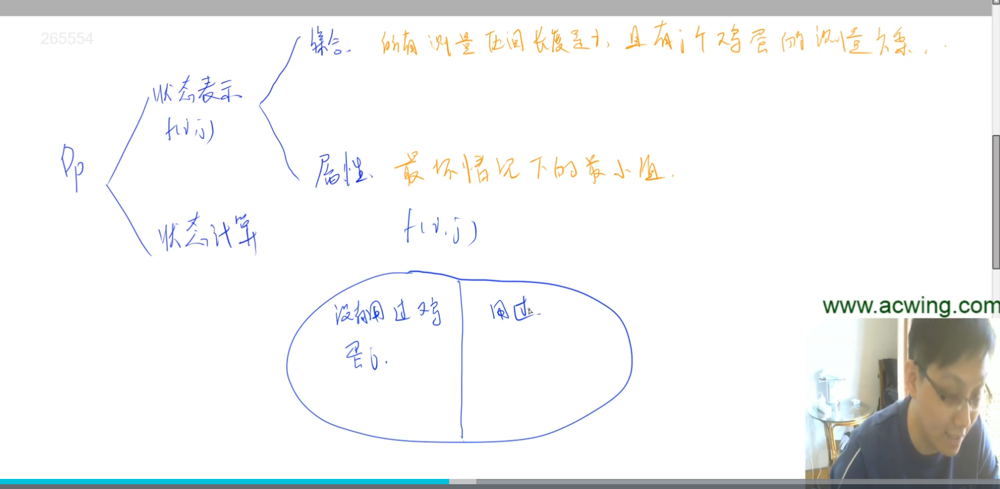
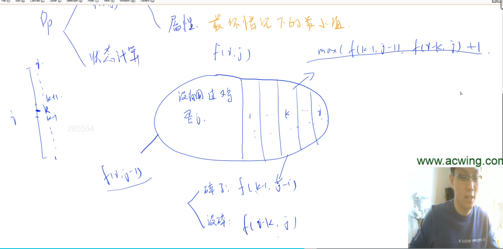
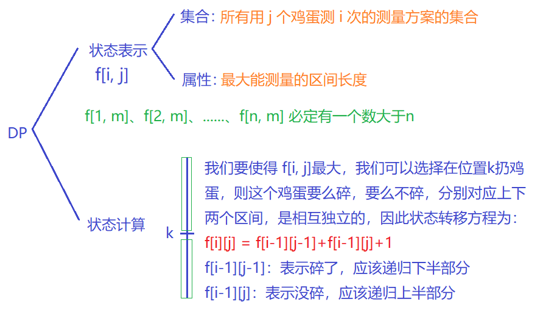

# 鸡蛋的硬度

google面试题。

## 题意

鸡蛋硬度的定义：如果鸡蛋从高楼的第a层摔下来没摔破，但是从a+1层摔下来时摔破了，那么就说这个鸡蛋的硬度是a。

输入：两个正整数 n 和 m，其中 n 表示楼的高度，m 表示你现在拥有的鸡蛋个数，这些鸡蛋硬度相同，并且小于等于 n。

你可以假定硬度为 x 的鸡蛋从高度小于等于 x 的地方摔无论如何都不会碎（没摔碎的鸡蛋可以继续使用），而只要从比 x 高的地方扔必然会碎。

求：最坏情况下所需要的扔鸡蛋次数。

样例解释：如果只有一个鸡蛋，你只能从第一层开始扔，在最坏的情况下，鸡蛋的硬度是100，所以需要扔100次。如果采用其他策略，你可能无法测出鸡蛋的硬度(比如你第一次在第二层的地方扔,结果碎了,这时你不能确定硬度是0还是1)，即在最坏情况下你需要扔无限次，所以第一组数据的答案是100。

## 动态规划

为什么用动态规划？因为如果爆搜的话，要搜的情况是指数级别的。

## 解法1（网上最多，时间复杂度稍高）

- 状态表示：所有i层楼，用j个鸡蛋的测量方案。属性：最坏情况下的最小值。
- 状态计算：
  - 不使用第j个鸡蛋，方案数为f[i, j - 1]
  - 如果使用第j个鸡蛋，需要考虑这第j个鸡蛋用在哪一层。共有1~i层楼共i种情况可以扔，假设在第k层扔：
    - 蛋碎，搜索区间变成1~k-1，鸡蛋个数减一，方案数为f[k - 1, j - 1]
    - 蛋没碎，搜索区间变成k+1~i，第j个蛋可重复利用，方案数为f[i - k, j]
    - 枚举扔的楼层k，在所有可行方案中选择最大值即为最坏情况
- 最终答案就是以上这些情况的最小值 min(f[i,j-1], max(f[k-1, j-1], f[i-k, j] + 1))。里面取max，是因为要求最差情况下的最小值。虽然我们可以控制第j个鸡蛋用在哪一层，但我们控制不了它是碎还是没碎。外面取min，是因为用不用鸡蛋j, 是我们可控的。所以要想清楚一点，哪些情况是我们可以控制的，哪些是我们控制不了的。可以控制的，就全取对我们最有利的，凡是控制不了的情况，我们就要考虑最坏情况。这相当于，做最好的计划，做最坏的打算。
- 初始化。这种做法的边界的处理比较麻烦一点。所以我们就把第一层初始化，如果直接初始化i,j取0会比较麻烦。所以我们就直接规定i，j大于等于1，然后去初始化i,j等于1的情况。
  - f[i][1] = i.  因为用1个鸡蛋去测长度为i的楼，肯定是需要测i次的。
  - f[1][i] = 1. 如果高度是1，有i个鸡蛋，那也是只需要测1次。

### 解法1时间复杂度

n是楼高，m是鸡蛋个数。

状态数量是n\*m（直接看f[n][m], 所以有n\*m个状态）。k的话需要枚举，枚举的是第一维，第一维是n。所以总的时间复杂度是O(n^2*m)。

## 解法2

- 状态表示
  - 集合：所有用j个鸡蛋测i次的测量方案的集合。
  - 属性：最多能测量多长的区间。
- 状态计算：在这样一个表示方法下，我们只需要枚举f[i,m]:
  - 求是否 f[1,m] >= n? 如果是，则只用测一次。否则：
  - 求是否 f[2,m] >= n? 如果是，则只用测两次。否则：
  - ...
  - 求是否 f[n,m] >= m? 我们只要在这里面找到最小的 i 就可以了。

来想下怎么计算f[i,j]。f[i,j]里的所有方案，任意一种方案，抠出来考虑，设能测的最大高度是x。第一次一定是测某个高度。测完之后有2种结果：

- 如果鸡蛋碎了，说明要测量的位置在k的下面，此时一共还能测i-1次（因为第k层已经用了一次机会），最多只能用j-1个鸡蛋。
- 如果蛋没碎，说明要测的位置在k的上面，此时一共还能测i-1次，最多只能用j个鸡蛋（鸡蛋没碎，可以重复使用）。

我们的目标是让整个区间的长度最大，也就是让x最大。一旦k确定之后，蛋碎或不碎只能取一个，必然是碎或者不碎。如果碎，就下面；不碎，就上面。所以上下两边每次只能走一边。所以上下两边是完全独立的。那么我们要求整个区间长度的最大值，也就是x的最大值的话，必然是上面最大且下面最大。上面最大就是f[i-1,j], 下面最大就是f[i-1,j-1]。x就是f[i,j]，所以f[i,j] = f[i-1,j] + f[i-1,j-1] + 1。

### 解法2时间复杂度

O(n\*m)。因为状态数量是n\*m, 每次状态计算只有一次加法，是O(1)的，所以总的时间复杂度是O(n\*m)。

### 解法2初始化

这种写法初始化特别简单，因为f[i,j]的集合属性是最多能测量多长的区间。

f[i][0]=0, f[0][j]=0

因为0个鸡蛋测i次，最多能测量多长的区间是0。同理，j个鸡蛋测0次，最多能测量的区间长度也是0。

所以如果定义成全局变量的话，就不需要初始化，默认为0。
