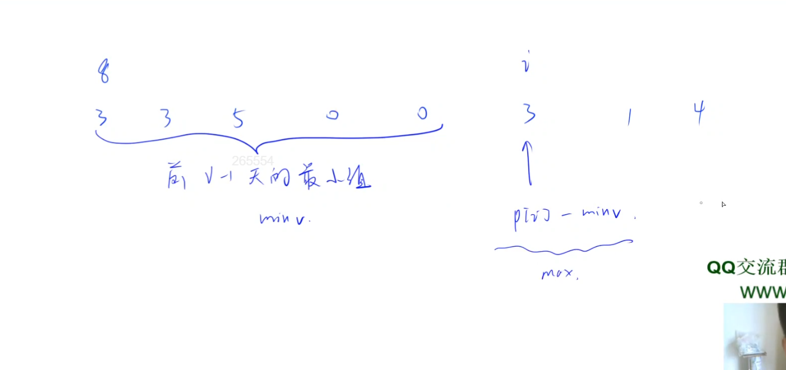
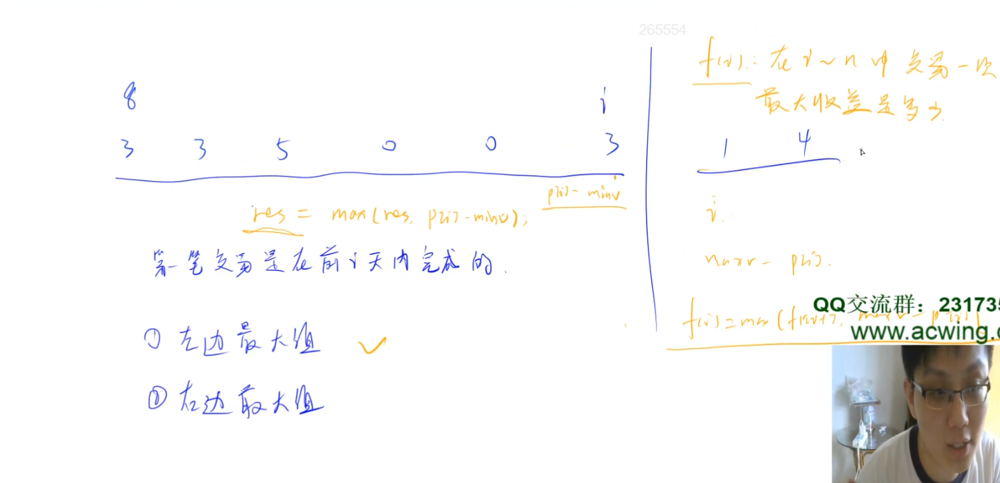

# 股票买卖 III

头条面试题。可以直接dp,但这里给出一种前后缀分解的解法。

## 题意

给定一个长度为 N 的数组，数组中的第 i个数字表示一个给定股票在第 i 天的价格。

设计一个算法来计算你所能获取的最大利润。你最多可以完成两笔交易。

注意: 你不能同时参与多笔交易（你必须在再次购买前出售掉之前的股票）。

## 分析

先考虑最简单的情况，只进行一次交易，如何获得最大收益？可以枚举在哪天卖。比如枚举到第i天卖，那怎么样才有最大收益呢？应该是在前面这些天里取一个最小值，也就是找个最便宜的一天买入。需要知道前i-1天的最小值 minv。用第i天的价格 p[i]-minv就是在第i天卖出的最大收益。接下来就是枚举每一天，求一个最大收益。

如果是进行2次交易，怎么办？这里有一个很常用的技巧，就是分段。凡是涉及到2次交易，或者是可以分成2段的问题，一般都有一个很常用的技巧，就是枚举这个分割线。因为分割线一旦确定，左右两边就变成2个子问题。

左边可以用g[i]表示在[1,i]中交易一次获得的最大收益。右边用f[i]表示在[i,n]交易一次获得的最大收益。

对于g[i], 要么在前i-1天卖，要么在第i天卖。前i-1天卖的最大收益是f[i-1], 第i天卖的最大收益是p[i]-minv。所以 g[i] = max(g[i-1], p[i] - minv)。这个递推式求g[i]，需要先知道g[i-1]，所以正着遍历。

对于f[i], 枚举在哪天买入。比如如果在第i天买入，在后面卖出应该找价格最高(maxv)的一天卖出, 最大收益是 maxv - p[i]。f[i]的递推式，如果第i天买，最大收益是 maxv - p[i];如果第i天不买，最大收益是 f[i+1], 所以 f[i] = max(f[i+1], maxv - p[i])。注意这个递推式，因为求f[i]需要先知道f[i+1],所以需要倒着遍历。

先把g[i]和f[i]都预处理出来，然后枚举分界线，取最大值。
