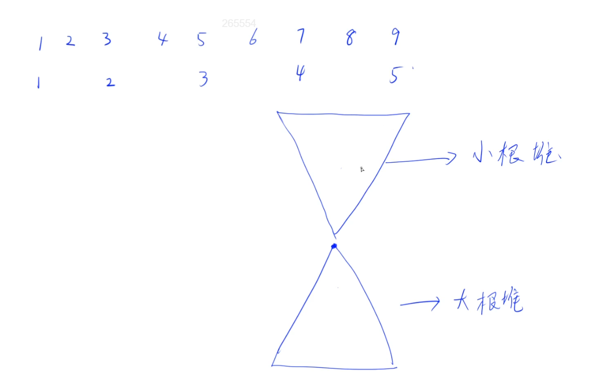

# 动态中位数

经典做法，对顶堆（沙漏）。

下面维护一个大根堆（记为down），上面维护一个小根堆(记为up)。用下面的大根堆存比较小的那一半数，用上面的小根堆存比较大的那一半数。保证当数是偶数个的时候，两个堆里的数量一样多；当数是奇数个的时候，下面的大根堆比上面的小根堆多一个。

只要能维护这样一个数据结构，那么下面大根堆的堆顶就必然是中位数。

## 如何维护这两个堆

我们可以保证这么几点：

1. 上面存的是较大的一半数，下面存的是较小的一半数。也就是说，上面的最小值也比下面的最大值大，或者相等。
2. 维护堆的大小。期望：下面最多比上面多一个元素。
   1. 怎么维护呢？其实很简单。假设现在我们已经维护好了这个数据结构，又来了一个x，怎么办呢？分情况来看。如果x <= down.Top(), x插到下面的大根堆；否则插到上面的小根堆。这样插完之后，上面所有元素都大于下面所有元素，这个性质是满足的。
   2. 怎么维护下面的个数最多比上面多1呢？其实也很简单，x插完之后判断一下，如果下面太多的话，因为down的堆顶元素就是下面的最大值，所以可以把堆顶插入到上面去。如果上面太多的话，up的堆顶元素是上面的最小值，所以把up的堆顶元素插到下面就可以。只要操作一次就可以维护好这两个性质啦！所以代码里用的是if不是for。

## 时间复杂度

O(n*log n)
