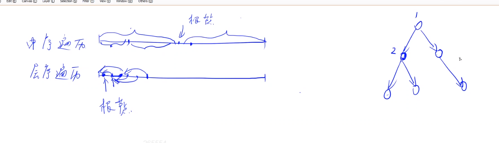

# 二叉树遍历

给定二叉树的**中序遍历**和**层序遍历**，求先序遍历。

这题算是难的。写起来比较抽象的。

## 解法

中序遍历和层序遍历可以重建树。只要告诉了我们哪些节点是空节点，就可以重建树。

层序遍历的第一个节点是根节点，找到根节点在中序遍历的下标。接下来需要判断根节点的左右儿子是否存在，也就是左右子树是否为空子树。如果左右子树不是空子树，那么层序遍历中的第二个值必然是根节点的左儿子，第三个值必然是根节点的右儿子。

接下来再看根节点的左儿子的左右子树是否存在。以此类推。

通过中序遍历，可以知道节点有没有左右儿子，以及左右子树的节点数量。以此类推。
