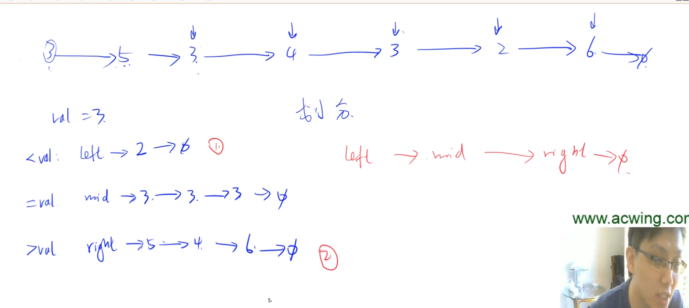

# 单链表快速排序

如果能改变value,那单链表的快排和数组的快排没什么区别。为了突出区别，一般都会要求不要改变链表节点的值，只能改变指针的值。

直接定义3个表头，第一个表头存所有小于value的值，第二个存所有等于value的值，第三个存所有大于value的值。然后依次遍历每一个点，小于的放左边，等于的放中间，大于的放右边。然后遍历链表。之后递归left和right, 最后把left,mid，right连上。

## 公司

- 旷视
