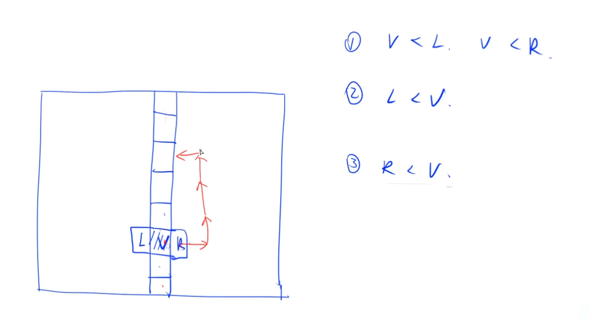
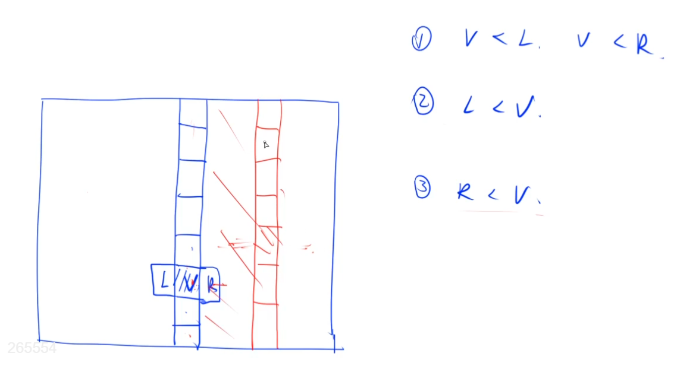

# 寻找矩阵的极小值

微软。

## 题意

n*n矩阵，每个数互不相同（非常重要）。定义极小值：如果一个数的值比与它相邻的所有数字的值都小，则这个数值就被称为极小值。一个数的相邻数字是指其上下左右四个方向相邻的四个数字，另外注意，处于边界或角落的数的相邻数字可能少于四个。要求在 **O**(**n**l**o**g**n**)的时间复杂度之内找出任意一个极小值的位置，并输出它在第几行第几列。

答案不唯一，输出任意一个极小值的位置即可。

## 解法

二分列。先找到中间列，找到中间列的最小值V。比较这个最小值V和它左(L)右(R)值的大小。如果比左右都小，就找到了一个极小值，直接输出。

如果 L < V, 说明左边值更小，那么就朝这个小的方向继续走。一个重要性质是，从L这边一直走，永远不可能再穿过中间这列，因为V是中间列的最小值，L又小于V，所以L也小于中间列上的任意一个值。一直保持朝小于自己的数走，是永远不可能再次穿过中间列的。于是就可以二分了。

## 时间复杂度

O(n*log n)
