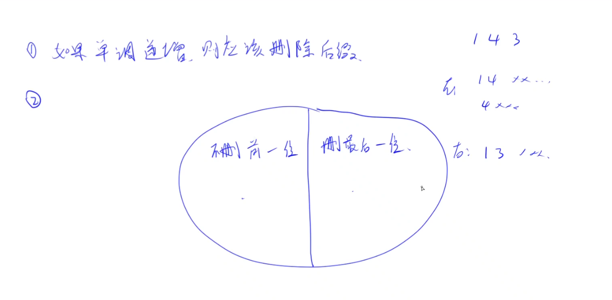

# 移掉K位数字

微软。经典的贪心问题。也有点像单调栈。

这类题如果没什么思路的话，先看一些简单情况。

思路是先删除数串中的逆序对。删完之后字符串变成单调递增，如果此时还有剩余的删除操作未用完，就把后缀去掉。最后再去掉前导0。

## 分析

如果数的每一位是单调递增的，如果要删应该怎么删？一定是从后往前删，才能使剩下的数最小。因为删前面的话，后面的数会往前错位，这样一来前面某些位就会变大。

如果数不是单调递增的，也就是一般情况，可以用排除法，或者类似于dp分析法，先找所有方案。现在需要找一个最小值，所有删除的方案是指数级别的 $C_{n}^{k}$ 种，假设下面的大圆是所有n位中选k位删除的所有方案，我们从前往后依次考虑每一位。比如 1432219，如果出现一个逆序，删掉它和不删掉它，有什么区别。

左半圆是不删逆序对的前一位，右半圆是删逆序对的前一位。左半边的所有方案肯定都是比右半边的所有方案要大的，所以最优解必然是在右边里面选。像dp的话，是区分不出来左右两边到底谁更大，所以都算一遍，取最小值。而贪心是比较特殊的问题，可以发现一边肯定不如另一边好。
