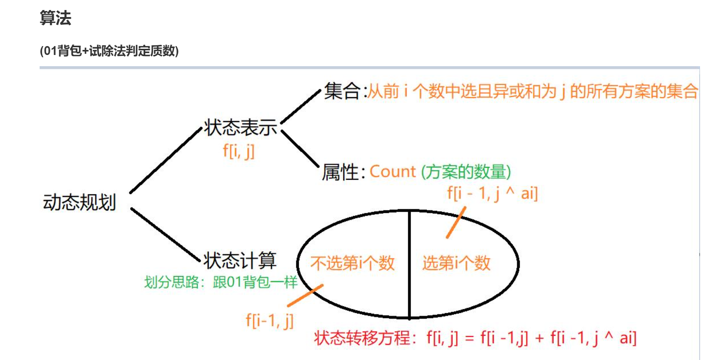

# 异或和是质数的子集数

Hulu。不难，但是不要被带到沟里。乍一看是个数学问题，其实是个dp问题，01背包。

1. 数据范围最大的数是5000, 而2^12 = 4096，因此考虑异或和最大的数是 2^13 - 1（因为异或是不进位加法，所以无论怎么异或都不可能超过最大的数表示二进制位全是1的数）
2. 所有组成的子集里找出异或和包含在[0, 2^13-1]有多少个。对应01背包，从n个物品中选k个物品符合某些限制的方案数，上图给出闫式dp分析法

## 关于异或

- 异或和就是所有数异或起来
- 异或又称为不进位加法，比如加法里的交换律、结合律，异或里全部都有。而且异或还相当于把加法和减法都统一起来了。因为如果想让总和加上一个数的话，是异或上$A_i$, 想去掉一个数的话也是异或上$A_i$。

## 时间复杂度

- 二维状态的第二维空间至少是$2^{13}$, 记为m
- dp过程的时间复杂度：
  - 状态数是 O(n⋅m)
  - 状态计算是 O(1)
- 试除法的时间复杂度是 O(m⋅sqrt(m))

## 空间复杂度

题目空间复杂度限制64MB, 如果用两维，不用滚动数组，意味着我们要开n*m大小的空间，也就是5000\*$2^{13}$=5000\*8192, 约等于 5000\*10000=5000,0000（五千万）。 五千万长度的int数组。一千万是需要40MB(一千万等于10的7次方，约等于10MB, 一个int是4字节，所以4*10=40MB), 那么五千万就是200MB，是会超内存的。所以必须用滚动数组来做。
