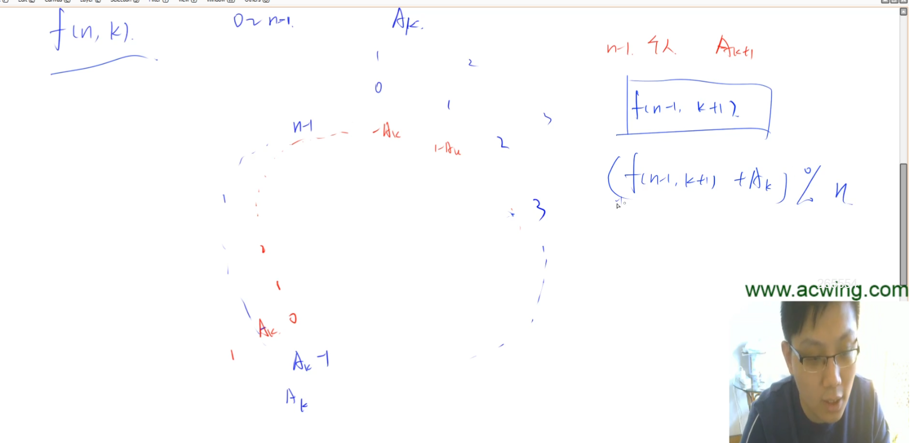

# 招聘

头条笔试。约瑟夫环问题的扩展。可以用dp做。

递推公式：

$f[n,k] = (f[n-1,k+1] + A_k) \% n$

## dp

- 状态表示 f[n,k]: 表示0~n-1这n个人围成一圈，从第k个数A[k]开始用，最终剩余的编号是多少。当删除一个人之后，我们将后面的人重新编号。在新编号中，我们最终的结果是f[n-1, k+1]。我们只要找到新旧编号的转换关系就找到了递推关系。
- 状态计算：$f[n,k] = (f[n-1,k+1] + A_k) \% n$
  - 首先看看f[n,k]表示的是啥。从第0个人开始报数，其报数1。第1个人报数2。第2个人报数3。以此类推。第$A_k-1$个人报数$A_k$。所以第$A_k-1$个人淘汰。下一个从第$A_k$个人开始报1。当删除一个人之后，我们将后面的人重新编号。也就是把第$A_k$个人编号成0，相当于把每个人的编号都减去一个$A_k$。这时候剩下来的人的编号就是 f[n-1, k+1]。因为n-1个人，从第$A_{k+1}$个数开始用。f[n,k] 和 f[n-1, k+1] 的编号之间有对应关系。后者的编号加上$A_k$再对 n 取模，映射到 0-n之间，就可以了。

## 时间复杂度

大家可能会担心说，状态有n*k = 10^7 * 10^3 = 10^10 个。但其实不用担心，因为这个两维状态里面并不是所有维都会用到。每个固定的n，我们只用求一个k就可以了。最开始求 f[n,1]，就需要求 f[n-1, 2], 求 f[n-2, 3], ..., 最后的边界就是 f[1, xxx]。边界 f[1,xxx] = 0, 因为只有1个人，必然会剩下，这个人的编号是0。

所以，时间复杂度其实是O(n)。

注意，如果用递归写，可能会爆栈或者爆内存。所以我们用迭代来写。那么就需要求f[1，xxx] 是多少。为了方便，我们把原本的$A_1,A_2,...,A_m$变成 $A_0,A_1,..,A_{m-1}$。我们先求一下f[1,xxx]这里的xxx应该是多少。找下规律：

- 当有n个人的时候，用的是0
- n-1,1
- n-2,2
- ...
- 1, (n-1)%m <===== 映射到0-m之间。从这儿往回倒着推一遍就行。
