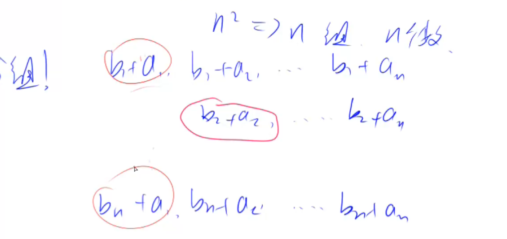

# 序列

二叉堆。多路归并。非常经典。难度也不是很大，但只要遇到二叉堆，就会碰到这个题。

这题分成2步来思考。

- 第一步：这题可以看成是合并m个序列，变成1个序列，这个序列里有m个数。也可以理解成，m*n的矩阵，合并成1\*m的矩阵。如果直接合并这m个序列不是很好做，那我们常用的思想就是每次合并2个，这样合并m-1次就可以了。第一次先合并前两个序列。这两个序列就是从每个序列里选一个数，然后计算一个和，一共有n^2个和。只保留最小的n个和。因为最后求的是总和最小的前n个数，除了前n个以外的其他数都没有必要留下来了。
- 第二步：也是这题里最重要的一步。假设只有2个序列a和b，从2个序列里各选一个数，算一下他们的和，保留最小的n个。这个该怎么做？这是本题的核心。如果暴力做，就是把所有n^2个和全部求出来。排个序，返回前最小的n个。这样时间复杂度是O(n^2)，非常不科学。如何优化？

## 优化

主要思想是分组法。先把a数组从小到大排好序。b数组排不排序无所谓。一共有n^2个和，把这n^2个和分成n组。

然后你就会惊奇的发现，每组内部的最小值就是这组的第一个数，因为a数组已经从小到大排序了。

这n^2个和里面最小的数是谁呢？只要从每组的第一个数里选一个最小值，它就是这n^2个和的最小值。

假设某个组的开头被选了，那么把它删掉，此时这组的最小值变成了它的下一个数。

那么第二小的数怎么选呢？就是再从这n组的每一组里的最小值，再选个最小的。

也就是，备选集合里永远只存n个数，存的是每一组里最小的数。每次从这个集合里选一个最小值出来，然后把这个数删掉，把这个数所在组的下一个数，拿过来再放到集合里。那这个集合用什么数据结构来维护呢？它支持2个操作，一个是取得最小值，一个是删除最小值，一个是加入一个新的数。那它显然就是一个堆。

这样合并2个序列的时间复杂度是O(n*logn)。所以合并m个序列的时间复杂度就是$O(m*n*logn)$。

## 堆里面应该存什么东西

- 要存一个和 sum
- 还需要知道每次从堆里把最小值拿出来，这个最小值所在组的下一个数是什么，所以还要再存一个当前元素在a数组的下标
