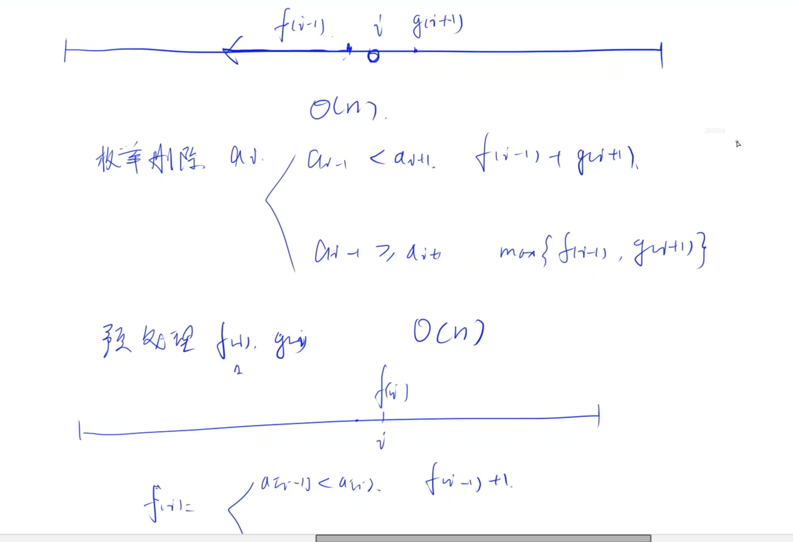

# 最长上升子串

美团笔试。枚举。

## 题意

给出一个长度为 n 的由正整数构成的序列，你需要从中删除一个正整数，很显然你有很多种删除方式，你需要对删除这个正整数以后的序列求其最长上升子串，请问在所有删除方案中，最长的上升子串长度是多少。

这里给出最长上升子串的定义：即对于序列中**连续**的若干个正整数，满足 $a_{i+1}>a_i$，则称这连续的若干个整数构成的子串为上升子串，在所有的上升子串中，长度最长的称为最长上升子串。

## 解法

枚举删除。删除一个数i之后，有2种情况：

1. 前后拼不起来。如果a[i-1] >= a[i+1], 就拼不起来。这时候答案就是左右两边取个max。
2. 前后能拼起来。也就是a[i-1] < a[i+1]。那最长的长度就是左右两边相加。

定义：

- f[i-1]: 从i-1往前走，沿着递减顺序往前走，最多能走多远。
- g[i+1]: 从i+1往后走，沿着单调递增往后增，最多能走多远。

### 预处理f[i], g[i]

递推计算即可。

- f[i]:
  - if a[i-1] < a[i], f[i] = f[i-1]+1
  - if a[i-1] >= a[i], 和前面的拼不起来，只能是f[i]自己，所以f[i] = 1
- g[i]: 和f[i]类似，只不过要翻转过来求
  - if a[i+1] > a[i], g[i] = g[i+1] + 1
  - if a[i+1] <= a[i], g[i] = 1

## 时间复杂度

O(n),等于扫了2遍。预处理O(n), 枚举删除O(n).
