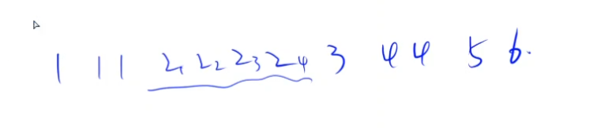

# 递归实现排列类型枚举 II

不重复排列问题。枚举顺序：枚举每个位置填哪个数。每个位置依次考虑当前没有用过的数，填过去。

去重核心操作：人为规定相同元素的相对顺序。最简单的情况是，规定所有元素的相对顺序不发生变化，就是一开始谁在前面，结束的时候它还在前面。

首先因为这题要求按字典序输出，所有需要先把所有数从小到大排序。排序有什么好处呢？就是所有相同的数都会排在一起。在枚举当前位置填哪个数的时候，当枚举到2的时候，我们填哪个2呢？因为我们是从前往后枚举，所以应该是填第一个没有用过的2。这样就可以保证在整个枚举的过程中，2的相对顺序不发生变化。因为从前往后枚举，肯定是先用第一个2，然后用第二个2... 每次枚举的时候，我们只用第一个没有用过的2，后面的那些2就不要再考虑了。

