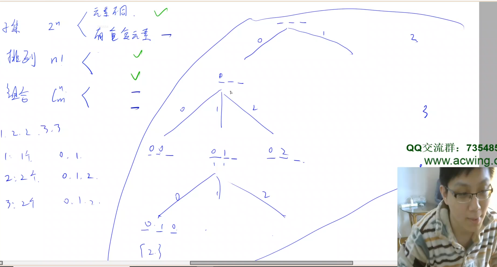

# 递归实现指数型枚举 II

## 题意

给定一个长度为 n 的可包含重复数字的序列，从中随机选取任意多个数字，输出所有可能的选择方案。

输入样例：

```
3
1 2 2
```

输出样例：

```
            <====== 表示空集
1
2
1 2
2 2
1 2 2
```

## 解法

首先，如果所有元素不同的话，那么每种元素就只有2种选择，选或不选。但这题是有重复元素。怎么办呢？我们就要按照元素的种数来枚举。什么叫种数呢？比如输入样例 1，2，2。只有2种元素1和2。

- 1：1个
- 2：2个

为了避免重复，每种在选的时候，不应该枚举这种当中选哪个，而只应该枚举这种里选几个。比方说有3个2，如果要看选哪个的话，就有3种选择，会有重复。所以这个题避免重复的核心点，在于不再枚举选哪个，而是枚举选几个。可以先去统计一下每种元素有多少个，然后递归枚举的时候，依次枚举这种里面选几个。比如1有1个，因此选择的个数就只有2种：选0个或者选1个。2有2个，因此选择的个数就有3种：选0个，选1个，选2个。

怎么考虑递归的过程呢？可以画一下递归搜索树：



假设题目给定的n个数分别是 1，2，2，3，3。那么搜索树中_ _ _ 表示每种类型的数选几个。第一种类型是1，只有1个，所以只有2个分支：选0个和选1个。第二层，枚举第二种选几个。第二种是2，有2个。所以有3个分支：选0个，选1个，选2个。第三层同理。

如何把递归搜索树转换成代码？主要先考虑参数是什么。首先，第一个参数是选到了第几种元素。第二个参数需要存的是当前每种元素选了多少个，用int数组存（int数组可以存成全局变量，这样就不用传到参数里了）。

还有一个这类问题很常用的技巧，就是可以先想办法把相同元素排到一起。这样的话，每一种元素都是其中的一段。枚举的时候是一段一段枚举的。每段里面枚举选几个。
