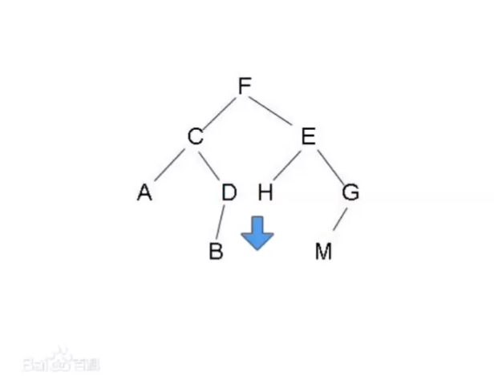

# 二叉树的下一个节点

剑指offer，google。就是求树的后继。

树的后继是指，当前节点在中序遍历里的下一个节点。

一般问这种问题，都会给出father域。LeetCode上没给father域的就比较奇葩。

## 解法

根据二叉树中序遍历的性质：

- 情况1：如果右子树存在，那么右子树最左侧的节点就是后继。例子：节点E的后继是M。
- 情况2：如果没有右子树，如果当前节点有father并且它是father的左儿子的话，那它的father就是当前节点的后继。例子：节点B的后继是D。
- 情况3：如果没有右子树，如果当前节点有father，并且它是father的右儿子的话，那么就要顺着它的父亲往上找，直到找到第一个当前节点是father的左儿子，那么father就是后继。例子：节点D的后继是F。如果一直找不到一个节点是father的左儿子，说明节点是中序遍历序列的最后一个，没有后继。

其实，情况2和情况3可以统一成情况3的解法，情况2也可以顺着父亲向上找，直到找到第一个当前节点是father的左儿子。合起来也就是：

- 如果当前节点有右儿子，则右子树中最左侧的节点就是当前节点的后继。比如F的后继是H；
- 如果当前节点没有右儿子，则需要沿着father域一直向上找，找到第一个是其father左儿子的节点，该节点的father就是当前节点的后继。比如当前节点是D，则第一个满足是其father左儿子的节点是F，即F是D的后继。
