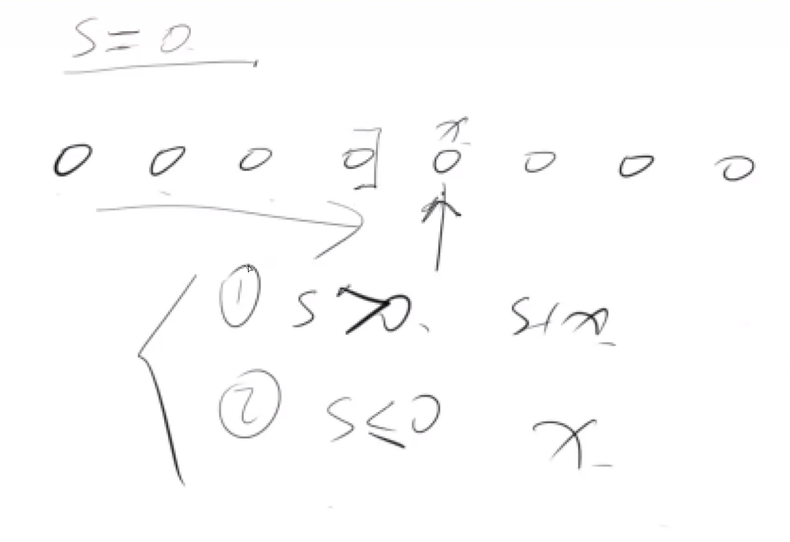

# 连续子数组的最大和

这其实是一个动态规划的题目。这题目比较特殊，可以用一个变量s来做动态规划。

s存的是：以 前一个数结尾的子数组的和的最大值。

分情况讨论：

- 当s > 0 时，s+x
- 当 s < 0 时，x。因为前面最大都会小于0，所以一定不会接上前面。前面不管怎么接，对我们来说都是一个负收益。那么以当前数结尾的子数组的和的最大值就是x。
- 当 s == 0 时，x。这种情况可以和上一种情况合二为一。

注意，代码里写的时候和想的时候是有些出入的。下面这种写法更简洁。

```
if s <= 0 {
    s = 0
}
s = s + x
```



## Follow up

这道题如果把子数组设定为至少m长应该怎么做？之前笔试遇到了这个题。

可以用前缀和的思想。枚举每个数nums[i]作为右端点，那么寻找以该点为右端点的最大子段，等价于找该点左边的最小前缀和。

如果加上长度至少为m的限制，那么在寻找最小前缀和的时候，只需要考虑 0 ~ i-m这部分就可以了，这里在枚举i的时候用
一个变量记录一下 0 ~ i-m 之间的最小前缀和就可以了，时间复杂度O(n)。

```
int maxSubArrayLeastLen(vector<int> &nums, int k) {
    // 开始搜索最小前缀和数组的位置
    int last = -1;
    int res = INT_MIN;
    int min_pre_sum = INT_MAX;
    vector<int> pre_sum(nums.size() + 1);
    for (int i = 0; i < nums.size(); i++) {
      pre_sum[i + 1] = pre_sum[i] + nums[i];
      // i - st + 1 == k
      // 搜索停止位置
      int st = i + 1 - k;
      // 搜索最小前缀和数组，从上一次停止的位置 last 开始
      while (last < st) {
        min_pre_sum = min(min_pre_sum, pre_sum[last + 1]);
        last++;
      }
      res = max(res, pre_sum[i + 1] - min_pre_sum);
    }
    return res;
}
```
