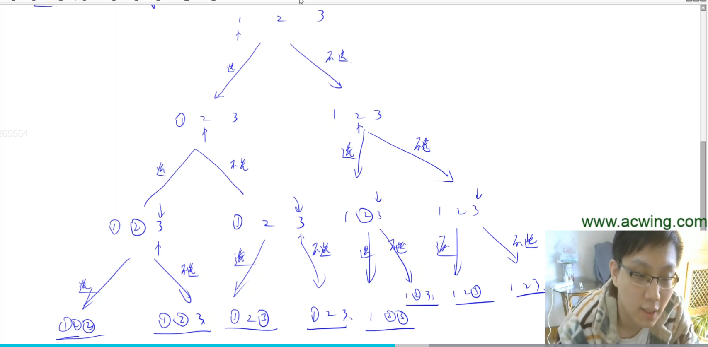

# 递归实现指数型枚举

## 题意

给[1,n] 的n个数，从中随机选取任意多个，输出所有可能的选择方案。其实就是输出所有子集。

输入样例：3

输出样例：

```
    <==== 空集也算一行
3
2
2 3
1
1 3
1 2
1 2 3
```

## 解法

像这些求方案啊，全排列啊，组合类型啊，就是方案数量是指数级别的问题，一般都是用递归来求。有很多人不太适应这个递归的求解方式。这里详细讲一下递归的理解方式。

如果觉得递归理解起来比较困难，一定要画一个递归搜索树。所有的递归问题都可以对应到一棵递归搜索树。

看一下这道题怎么转换成一棵递归搜索树。

1~n 一定要考虑枚举顺序，枚举顺序一般有很多种，大家选择一种最习惯的就可以了。比如，把[1,n]的每一个数先列出来，从前往后依次考虑每个数要不要选。选和不选就是两个分支。对于每个分支，分别递归处理。当做完n个数之后（也就是考虑完n个数之后），就可以得到一个方案了。用树的形式画一下：



圈住的数字表示选了，没圈的表示不选。两个分支代表选和不选。每个叶子节点就代表一种方案。

更复杂的dfs也能转换成递归搜索树，只不过可能不止两叉，可能会有多叉。因为每个叉表示的是递归的一个分支，有几个分支，就有几叉。

下面要做的就是把递归搜索树转换成一个递归函数。要考虑几个问题：

1. 参数需要选哪些。参数只要把我们需要用到的信息存下来就可以了。
   1. 第一个需要记录的是，当前是在递归搜索树的第几层。因为第一层是枚举第一个数，第二层是枚举第二个数。需要判断当前看的是哪个数。所以需要参数表示当前考虑第几个数（用u表示）。
   2. 第二个需要记录的是，前面的数有没有选。用bool数组来表示。
