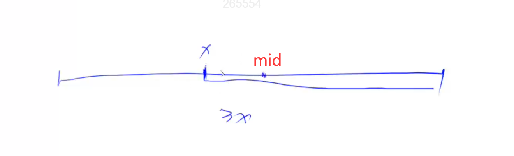

# 二分求左边界和右边界

## 求右边界

定义性质：<=x，二分求出来的结果就是边界，也正好是右边界。

如果 q[mid] <= x, 满足性质，按照上图，x 一定在mid右边。即x在 [mid, r] 区间。

## 求左边界

定义性质：>=x, 二分出来的结果就是边界，在这个性质下，求出来的正好是左边界。

如果 q[mid] >= x, 按照上图，x一定在 mid 左边，也就是在 [l,mid]区间。
