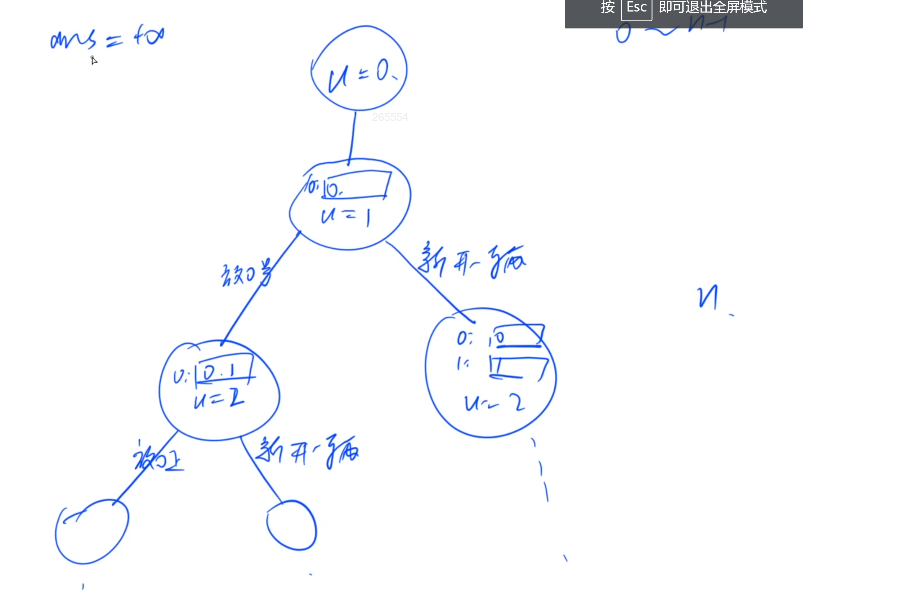

# 小猫爬山

小猫坐缆车，每个缆车有最大可承受重量。问最少租多少辆缆车，一共最少花多少钱。每个缆车1美元。

## 时间复杂度

爆搜的时间复杂度一般就说是指数级，不太好算。

## 搜索顺序

顺序非常重要。一定要找到一种顺序，能把所有方案都枚举到。

从前往后以此枚举每一只小猫，枚举把当前小猫放到哪辆缆车上。用u从0到n-1枚举所有小猫。

- u=0,第1只小猫，由于一辆车都没有，所以我们只能把它放到一辆新车上。
- 从u=1 开始，就有多种决策：
  - 把u=1这只小猫放在0号车上
  - 新开一辆车，第一辆车放小猫0，第二辆车放小猫1

## 剪枝

### 优化搜索顺序

尽量先搜分支少的节点。把一个比较轻的猫和一个比较重的猫，放在车上，哪个带来的分支数量会更少一些啊？那当然是重的猫带来的分支数量少一些。因为放重猫，比如可以把这个车占满，后面的猫就都不能放这个车上了；如果放个轻的猫，像空气一样不存在，那后面的猫就可以随便放到这辆车上。因此，优先放重猫的话，就可以减少未来的选择数量。所以我们应该把猫按重量从大到小排序，优先放重猫。

### 排除等效冗余

不存在。

### 可行性剪枝

可以做。如果发现猫上缆车之后超出重量，就不用继续搜了。

### 最优性剪枝

如果当前新开的车的数量，已经大于等于ans了，也可以直接退出。
