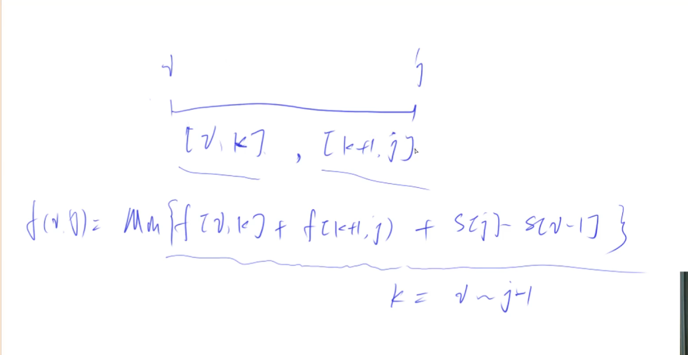

# 石子合并

关键点：最后一次合并一定是左边连续的一部分和右边连续的一部分进行合并。

- 集合表示：所有将第i堆石子到第j堆石子合并成一堆石子的合并方式。
- 集合划分：以最后一次合并的分界线位置来分类。

  - 左边1个
  - 左边2个
  - ...
  - 左边k-1个 (k=j-i+1,区间里的元素个数)
- 状态计算：每一类的最小代价怎么求呢？等于左边的最小代价，加上右边的最小代价，再加上最后一步的代价（最后一步一定是合并最后2堆，其代价为从i到j的石子重量之和，可以用前缀和来求）。
- 枚举顺序：显然长的区间是由更短的区间合并而成，所以先枚举区间长度 len，接着枚举左端点 l（右端点由左端点和区间长度去确定），最后枚举分段点 k，从而计算出结果。所有的区间dp问题枚举时，第一维通常是枚举区间长度，并且一般 len = 1 时用来初始化，枚举从 len = 2 开始；第二维枚举起点 i （右端点 j 自动获得，j = i + len - 1）

## 时间复杂度

状态数量*转移的计算量。状态是两维，所以数量是n^2。每次转移计算需要遍历k，所以转移的计算量是N。总的时间复杂度是O(n^3)。
