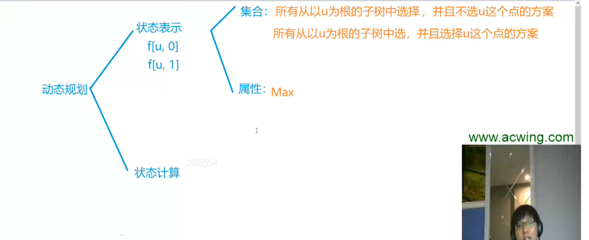
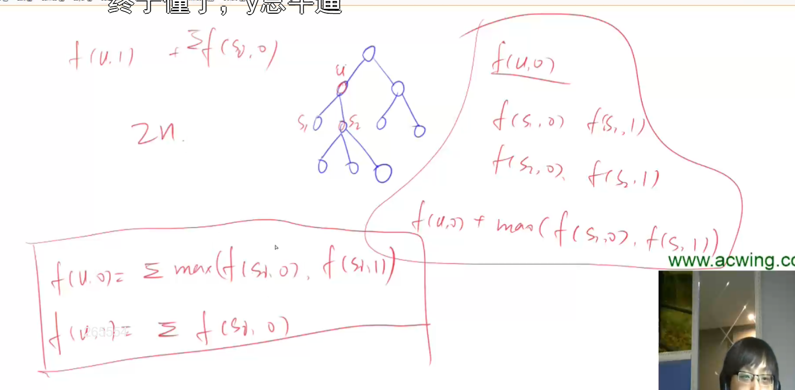

# 没有上司的舞会

校长是树根，每个点的父节点是这个节点的直接上司。树用图的方式存就行，因为树是特殊的图。

邀请一些人来参加舞会，其中不存在一个人是另一个人的上司。求所有参加舞会的职员的总的最大高兴度是多少。

- 状态表示：
  - f[u,0]: 所有从以u为根的子树中选择，并且不选u这个点的方案
  - f[u,1]: 所有从以u为根的子树中选择，并且选择u这个点的方案

## 时间复杂度

状态数量*转移的计算量。状态数量为2n,
