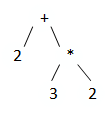
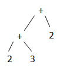
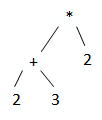
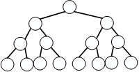
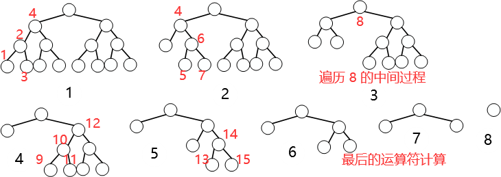

# 表达式求值

是个模板题，可以背下来。而且可以扩展运算符，因为计算的过程里并不涉及具体运算符。

双栈+操作符优先级实现。

## 问题解法

### 1. 数据结构

由于是模拟中序遍历树的过程（实际不用建树）, 所以要用栈数据结构。

由于是有运算符和数字两个对象, 所以要用两个栈来存储。

### 2. 算法

遇到各节点后的处理：

1. 数字。数字并不会产生计算过程, 所以只需提取数字, 将数字压栈。
2. 括号。括号分为两个运算符 ( 和 )。遇到 ( 说明会往下走, 所以只需将 ( 压栈。遇到 ) 说明会往上走, 所以要计算括号表示的子树的结果, 所以要逆向计算运算符直至遇到 (。
3. 普通二元运算符。如果当前运算符优先级比上一运算符高, 说明是往下走, 则只需将运算符压栈。如果当前运算符优先级比上一运算符低, 说明是往上走, 则需要一直计算上一运算符直至当前运算符优先级比上一运算符高。

## 核心代码实现

```
for(int i = 0; i < s.size(); i++)
{
    char c = s[i];              // c 是当前字符
    if(isdigit(c))              // 如果 c 是数字, 就提取数字
    {
        int x = 0, j = i;
        while(j < s.size() && isdigit(s[j])) x = x * 10 + s[j++] - '0';
        i = j - 1;
        num.push(x);
    }
    else if(c == '(') op.push(c);       // 如果 c 是 '(', 就压栈
    else if(c == ')')                   // 如果 c 是 ')', 就一直计算到 '(' 
    {
        while(op.top() != '(') eval();  // eval 函数的功能是计算上一运算符
        op.pop();                       // '(' 出栈
    }
    else                                // 如果 c 是普通运算符, 就一直计算到 c 的优先级比上一运算符高
    {
        while(op.size() && pr[op.top()] >= pr[c]) eval();
        op.push(c);                     // c 入栈
    }
}
```

## 问题分析

### 1. 问题分析

"+" 和 "-" 等价, "*" 和 "/" 等价。所以只需分析 + 和 *。

(1) "*" 优先级比 "+" 大，2+3∗2 对应的树为：



(2) 同优先级左边大于右边

2+3+2对应的树为：



(3) 括号优先级大于其他

（2+3）*2对应的树为：



看起来是"+"的优先级比"\*"大，其实是因为括号的优先级比"*"大。

### 2. 总结特点

- 优先级大的运算符在下面, 优先级小的运算符在上面
- 叶节点都是数字, 内部节点都是运算符, 括号不作为节点, 但会作为一个运算符参与运算符优先级的比较

## 问题建模

### 1. 中序遍历表达式树的计算过程

任意一个表达式树：



叶节点是数字, 内部节点是运算符

计算过程：



- 遍历节点 1 2 3 后, 则 4 的左子树遍历完, 则计算 4 的左子树的结果, 新节点作为 4 的左孩子节点
- 继续遍历节点 5 6 7, 则 8 的左子树遍历完, 则计算 8 的左子树的结果, 新节点作为 8 的左孩子节点
- 同理, 遍历节点 12 的时候计算其左子树的结果, 新节点作为 12 的左孩子
- 当整棵树遍历完后, 再次逆序计算各运算符的结果, 最后只剩一个节点就是表达式的最终结果
- 注意计算 8 的左子树时先计算运算符 6, 然后结果作为运算符 4 的右孩子, 然后计算运算符 4, 其结果作为运算符 8 的左孩子

### 2. 计算过程分析

如何判断某棵子树被遍历完？

- 中序遍历往上走时, 子树遍历完。例如过程 1 中遍历节点 4 时, 说明 1 2 3 的子树遍历完
- 中序遍历往下走时, 子树未遍历完。例如过程 2 中遍历节点 6 时, 相对于 4 是往下走的, 此时 8 的左子树未遍历完

如何判断往上走还是往下走？

- 注意到运算符优先级大的在下面, 运算符优先级小的在上面
- 所以当目前运算符的优先级比上一运算符优先级小时, 说明是往上走
- 当目前运算符的优先级比上一运算符优先级大是, 说明是往下走

什么时候进行计算？

- 往上走时, 因为此时子树遍历完, 需要计算子树的结果, 并将结果作为一个新的节点代替原来的子树。例如遍历节点 8 时, 计算 8 的左子树, 然后将计算结果作为新的节点代替原来的左子树
