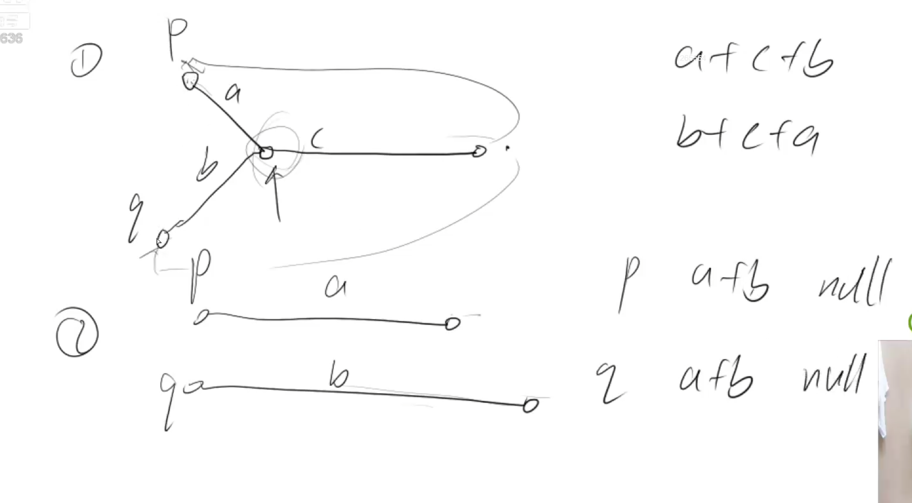

# 两个链表的第一个公共结点

1. 用两个指针 p1，p2 分别指向两个链表 headA，headB 的头结点，同时向后遍历。
2. 当指针到达链表末尾时，重新定位到另一个链表的头结点。
3. 当它们相遇时，所指向的结点就是第一个公共结点。

证明：

如下图，有2种情况，一种是有公共结点，另一种是没有公共结点。

- 第一种情况，按照上面所说的走法，p走过的总路程是a+c+b。q走过的总路程是b+c+a。是一样的。最终p和q会在公共结点相遇。
- 第二种情况，按照上面所说的走法，p走过的总路程是a+b。q走过的总路程是b+a。也是一样的。最终p和q会在空节点null相遇。

