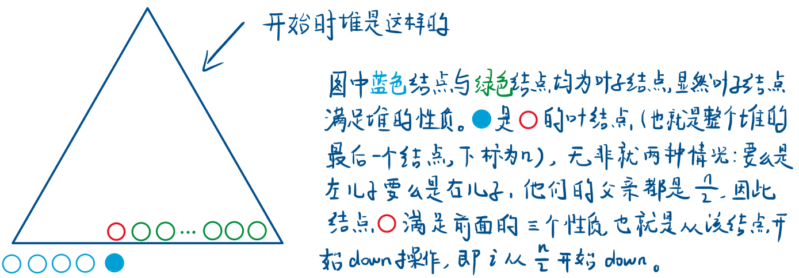

# 堆排序

把数据组织成堆结构，然后每次输出堆顶。

## O(N)建堆

一般建堆，大家会用插入元素操作，所有元素插入一遍，时间复杂度O(n*logn)。

其实还有一种O(n)的建堆方法，就是从n/2开始down。

```
// O(N) 建堆
for i := n / 2; i > 0; i-- {
    down(i)
}
```

i为什么从n/2开始down？

首先要明确要进行down操作时必须满足左儿子和右儿子已经是个堆。

开始创建堆的时候，元素是随机插入的，所以不能从根节点开始down，而是要找到满足下面三个性质的结点：

1.左右儿子满足堆的性质。

2.下标最大（因为要往上遍历）

3.不是叶结点（叶节点一定满足堆的性质）

那这个点为什么时n/2？看图。


