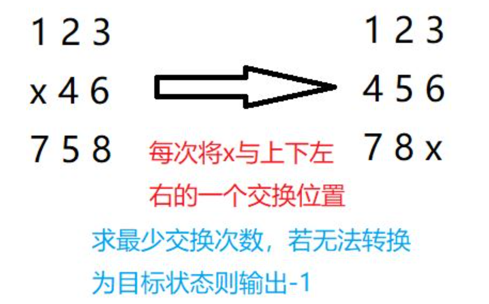
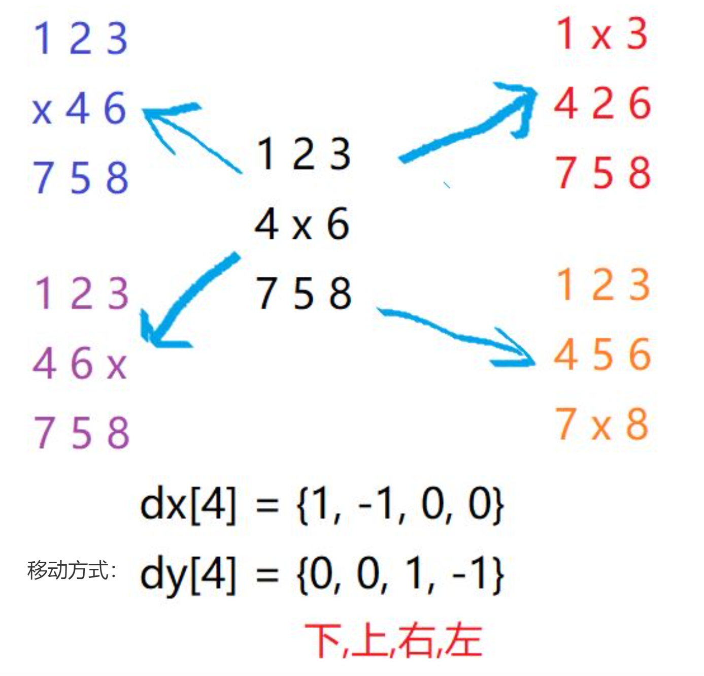
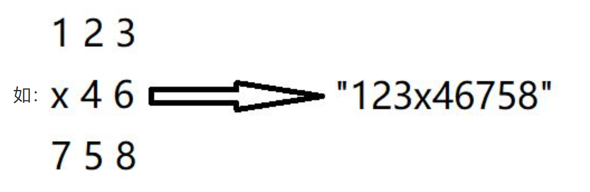
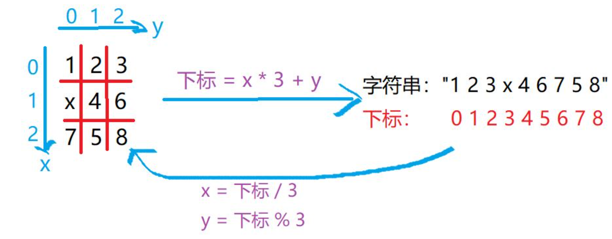

# 八数码问题

## 题目目标



求最小步数 -> 用BFS

## 状态转移情况



转以后：a = x + dx[i], b = y + dy[i].

思想：将每一种情况作为1个节点，目标情况即为终点

从初始状况移动到目标情况 —> 求最短路

## 问题

- 怎么表示一种情况使其能作为节点？
- 如何记录每一个状态的“距离”（即需要移动的次数）？
- 队列怎么定义，dist数组怎么定义？

## 解决方案

将 “3*3矩阵” 转化为 “字符串”



所以：

```
队列可以用 queue<string>
//直接存转化后的字符串
dist数组用 unordered_map<string, int>
//将字符串和数字联系在一起，字符串表示状态，数字表示距离
```

## 矩阵与字符串的转换方式


