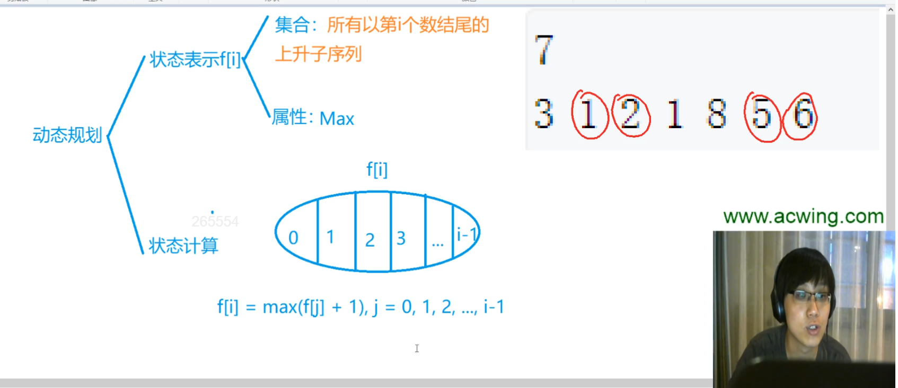

# 最长上升子序列

f[i]: 表示从第1个数开始算，以第i个数结尾的最长上升子序列

f[i]可以划分为若干类。以第i-1个数是哪个数来分类：

- 第1类：最极端的情况，以i结尾的最长上升子序列长度是1。只有i一个数。
- 第2类：倒数第2个数是a[1]（数组里第一个数）
- 第3类：倒数第2个数是a[2]
- 最后一类：倒数第2个数是a[i-1]

也就是，上一个数只有这么i种情况。当然了，这里面每一类不一定都存在。

## 时间复杂度

动态规划的时间复杂度是最好算的，就是状态数量*转移的计算量。

对于本题，状态数量是线性的n，每次计算f[i]，都需要枚举[0...i-1]，所以转移的计算量是n。因此，时间复杂度是o(n^2)。
