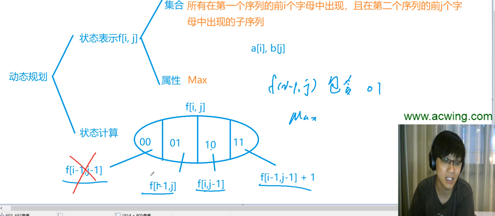

# 最长公共子序列

给定两个长度分别为 N 和 M 的字符串A和B，求既是A的子序列又是B的子序列的字符串长度最长是多少。

- 集合表示：f[i][j]表示a的前i个字母，和b的前j个字母的最长公共子序列长度
- 集合划分：以a[i]和b[j]是否包含在子序列当中，来划分。因此可以分成4类：

  - a[i]不在，b[j]不在。max=f[i−1][j−1]
  - a[i]不在，b[j]在。max=f[i−1][j]。看似是max=f[i−1][j], 实际上无法用f[i−1][j]表示，因为f[i−1][j]表示的是在a的前i-1个字母中出现，并且在b的前j个字母中出现，此时b[j]不一定出现。这与条件不完全相等，条件给定是a[i]一定不在子序列中，b[j]一定在子序列中。但仍可以用f[i-1][j]来表示，原因就在于条件给定的情况被包含在f[i-1][j]中，即条件的情况是f[i-1][j]的子集，而求的是max，所以对结果不影响。
  - a[i]在，b[j]不在。max=f[i][j−1]。原理同上。
  - a[i]在，b[j]在。max=f[i-1][j-1]+1

  实际上，在计算时，第1种情况包含在第2种和第3种情况中，所以第1种情况不用考虑。

## 时间复杂度

状态数量是n^2, 状态转移是3次计算O(1)的，所以时间复杂度是两者相乘，就是O(n^2).
