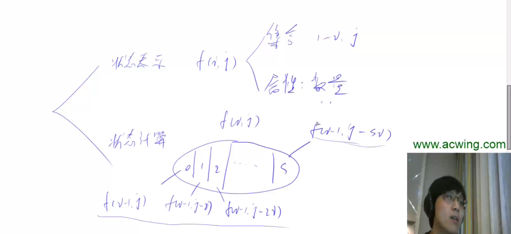
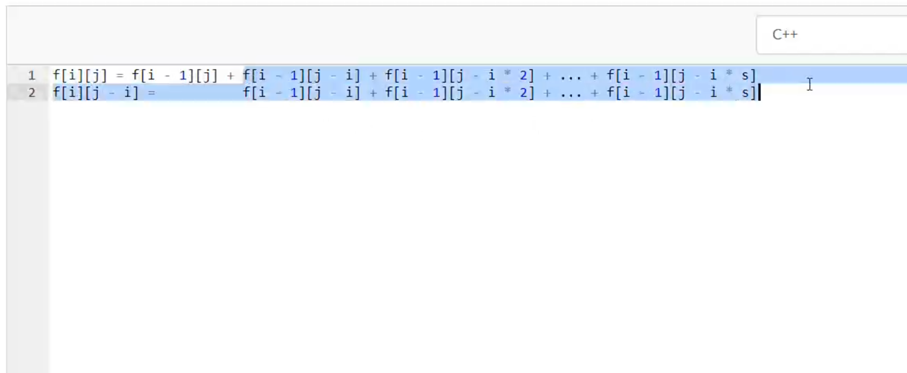
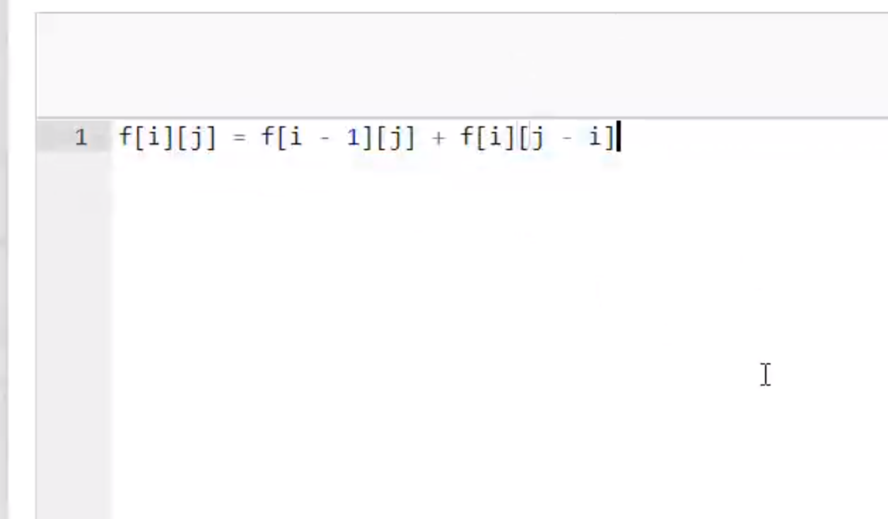
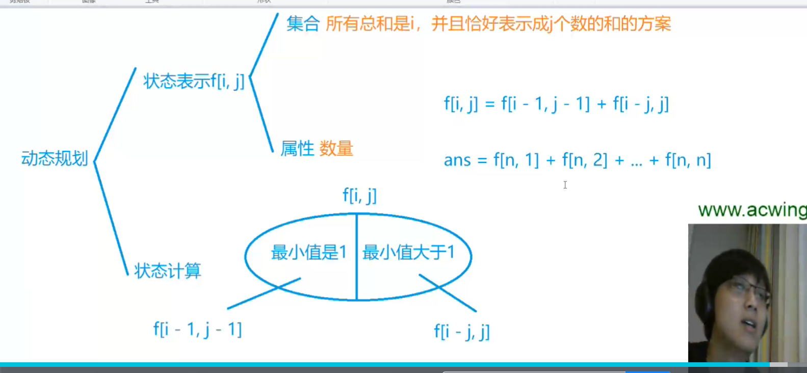

# 整数划分

## 方法1：转换成完全背包问题

思路：把1,2,3, … n分别看做n个物体的体积，这n个物体均无使用次数限制，问恰好能装满总体积为n的背包的总方案数（完全背包问题变形）

题目规定了划分的数字是从大到小，所以其实是不考虑顺序的, 也就是说，5=2+2+1，和5=1+2+2，算成一种。

- 集合表示 f[i][j]：从1到i中选，总体积恰好是j的所有选法的集合，集合属性是数量。
- 集合划分：第i个物品，选0个，选1个，选2个，...，选s个。
- 状态计算：f[i][j] = f[i-1][j] + f[i-1][j-i] (这是优化后的结果，选第i个物品和不选第i个物品。优化方法同完全背包)

### 优化

## 方法2

稍微有点难想。

- 集合：所有总和是i,并且恰好表示成j个数的和的方案。属性：数量
- 集合划分：

  - 如果最小值是1，由于这里面每个方案都存在一个1，我们把这里面每一个方案里的1去掉，会变成一个什么样的方案呢？f[i-1][j-1], 所有和是 i-1, 表示成 j-1 个数的方案。

  * 如果最小值不是1，也就是这里面每个方案里的数都严格大于1，可以把每个数都减去一个1，那么每个数还是正整数。每个数都减去1，方案就会变成 f[i-j][j]。

