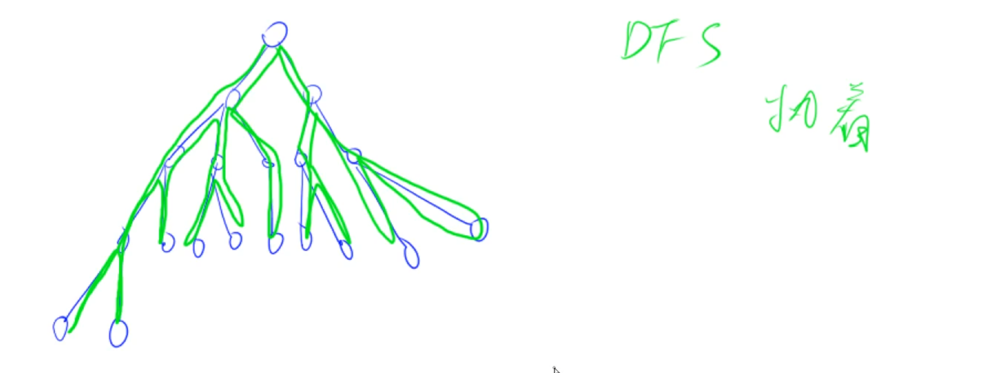
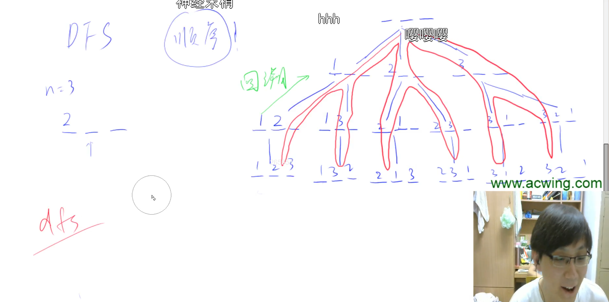

# DFS

DFS是个很执着的人。不管走哪条路，一定会走到头。走不到头的时候是不可能回来的。一旦走到头了，回去的时候，也不是说直接回到头了，而是边回去边看，能不能继续往前走。只有确定当前点所有路都走不了的时候，才会往回退一步。

DFS包含2个概念：回溯和剪枝。每个DFS都对应一棵搜索树。DFS俗称爆搜。

DFS最需要考虑的一个点，就是要把顺序想清楚。要用一个什么样的顺序，来把某道题的所有方案全部遍历一遍比较方便。

回溯的时候一定要注意：恢复现场。

没有必要把DFS和递归区分的太开。没有必要区分他俩。系统会为我们自动做回溯的。系统有一个隐藏的栈来帮我们维护这个路径。

## 例题1：全排列

- 842

回溯的时候一定要注意：恢复现场。

## 题目

- 842 全排列
- 843 n皇后问题
