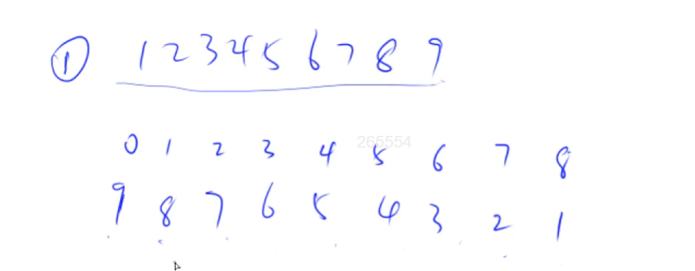

# 高精度加法

## 大整数保存

大整数是怎么保存的？其实是把大整数的每一位保存到数组里面。这就有个问题，存的时候，应该是高位在前，还是低位在前呢？应该倒着存，个位存到数组的第0个数里。为什么呢？因为方便存进位，在数组末尾添加进位是比较方便的。



## 模板

```go
package main

import (
	"fmt"
	"strconv"
)

func main() {
	var a, b string
	fmt.Scanf("%s", &a)
	fmt.Scanf("%s", &b)
	var A, B []int
	for i := len(a) - 1; i >= 0; i-- {
		digit, _ := strconv.Atoi(string(a[i]))
		A = append(A, digit)
	}
	for i := len(b) - 1; i >= 0; i-- {
		digit, _ := strconv.Atoi(string(b[i]))
		B = append(B, digit)
	}

	C := add(A, B)

	for i := len(C) - 1; i >= 0; i-- {
		fmt.Printf("%d", C[i])
	}
}

func add(A []int, B []int) []int {
	var C []int
	t := 0 // 进位
	for i := 0; i < len(A) || i < len(B); i++ {
        // 如果A[i]有值
		if i < len(A) {
			t += A[i]
		}
        // 如果B[i]有值
		if i < len(B) {
			t += B[i]
		}
        // 到这儿，t里存的就是A[i]+B[i]+上一位的进位t
		C = append(C, t%10)
	    // 看看要不要进位到下一位
		t /= 10
	}
    // 看下最高位，如果有进位的话，就是1
	if t > 0 {
		C = append(C, t)
	}
	return C
}
```

y总模板：

```
// C = A + B, A >= 0, B >= 0
vector<int> add(vector<int> &A, vector<int> &B)
{
    if (A.size() < B.size()) return add(B, A);

    vector<int> C;
    int t = 0;
    for (int i = 0; i < A.size(); i ++ )
    {
        t += A[i];
        if (i < B.size()) t += B[i];
        C.push_back(t % 10);
        t /= 10;
    }

    if (t) C.push_back(t);
    return C;
}
```

## 题目

- 791 高精度加法
