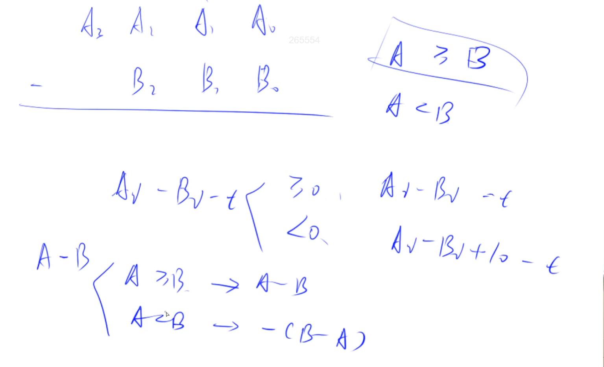

# 大整数减法

模板要求必须满足A >= B.

如果A < B，就算B-A，结果前面再加个负号。



## 模板

```
// C = A - B, 满足A >= B, A >= 0, B >= 0
vector<int> sub(vector<int> &A, vector<int> &B)
{
    vector<int> C;
    for (int i = 0, t = 0; i < A.size(); i ++ )
    {
        t = A[i] - t;
        if (i < B.size()) t -= B[i];
        // 相减后t的处理 ，把 t >=0 和 t < 0 用一个式子来表示 t = (t + 10) % 10
        C.push_back((t + 10) % 10);
        if (t < 0) t = 1;
        else t = 0;
    }
  
    // 去掉前导0
    while (C.size() > 1 && C.back() == 0) C.pop_back();
    return C;
}
```

## 题目

- 792 高精度减法