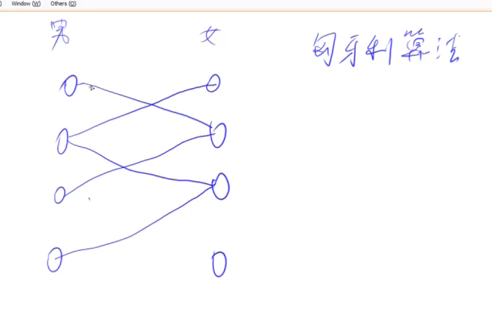

# 二分图

## 什么是二分图

把所有点划分到两边，使得所有的边都是在集合之间的。集合内部没有边。


## 染色法

染色法：判断一个图是不是二分图。方法：DFS染色。

图论一个很重要的性质：一个图是二分图，当且仅当这个图可以被2-染色。

一个图是二分图，当且仅当图中不含有奇数环。奇数环是指，环当中边的数量是奇数。证明：

如果图中存在奇数环的话，会推出矛盾：


## 染色法模板

n表示点数，m表示边数。时间复杂度 O(n+m)

```
int n;      // n表示点数
int h[N], e[M], ne[M], idx;     // 邻接表存储图
int color[N];       // 表示每个点的颜色，-1表示未染色，0表示白色，1表示黑色

// 参数：u表示当前节点，c表示当前点的颜色
bool dfs(int u, int c)
{
    color[u] = c;
    for (int i = h[u]; i != -1; i = ne[i])
    {
        int j = e[i];
        if (color[j] == -1)
        {
            if (!dfs(j, !c)) return false;
        }
        else if (color[j] == c) return false;
    }

    return true;
}

bool check()
{
    memset(color, -1, sizeof color);
    bool flag = true;
    for (int i = 1; i <= n; i ++ )
        if (color[i] == -1)
            if (!dfs(i, 0))
            {
                flag = false;
                break;
            }
    return flag;
}
```

## 二分图的最大匹配

### 1. 什么是最大匹配

要了解匈牙利算法必须先理解下面的概念：

匹配：在图论中，一个「匹配」是一个边的集合，其中任意两条边都没有公共顶点。

最大匹配：一个图所有匹配中，所含匹配边数最多的匹配，称为这个图的最大匹配。

### 2. 匈牙利算法

把左边看成男生，右边看成女生，之间有线就代表两个有感情基础。匹配就是边的集合，其中任意两条边都没有公共顶点，也就是没有脚踏两只船的人。然后一个男生一个男生看。看下这个男生所有看上的姑娘（从第一个开始看），如果还单身的话，他们就在一块了。成功之后再看下一个男生。如果男生看上的姑娘已经心有所属了，怎么办呢？这个男生是不会罢休的，他会不撞南墙不回头，他会一直尝试，看一下这个妹子现在看上的男生是谁，找到这个男生，看他能不能换个妹子。只有所有方法都尝试过了以后，才会放弃。

其中找妹子是个递归的过程，最关键的就是：有机会上，没机会创造机会也要上。



### 3. 匈牙利算法时间复杂度

一共考虑n个男生，所以时间复杂度首先乘上一个n。考虑每个男生的时候，最坏情况下把所有边都遍历一遍。所以最坏情况下时间复杂度是$O(n*m)$。

但实际在匹配的时候，对于每个男生其实不用看太多次就可以成功匹配了。所以匈牙利算法的实际运行时间远小于O(n*m)

## 题目

- 860 染色法判断二分图
- 861 二分图的最大匹配（匈牙利算法）

## 注意

数组越界之后，什么错误都有可能发生，不只是段错误或者runtime error，还有可能TLE等等。

本题容易发生数组越界的地方，就是邻接表存储图，e[M], ne[M]，大小是M（边数），不是N（顶点数）。
