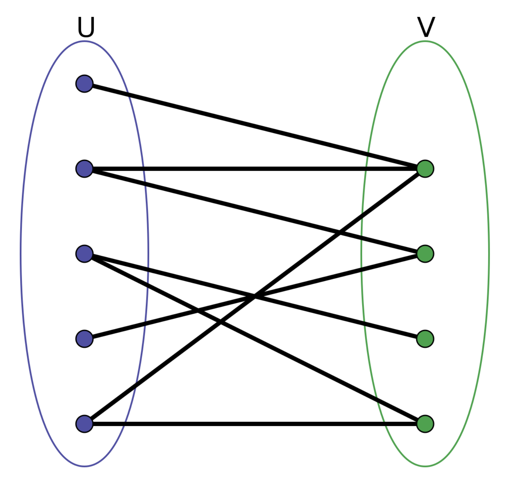
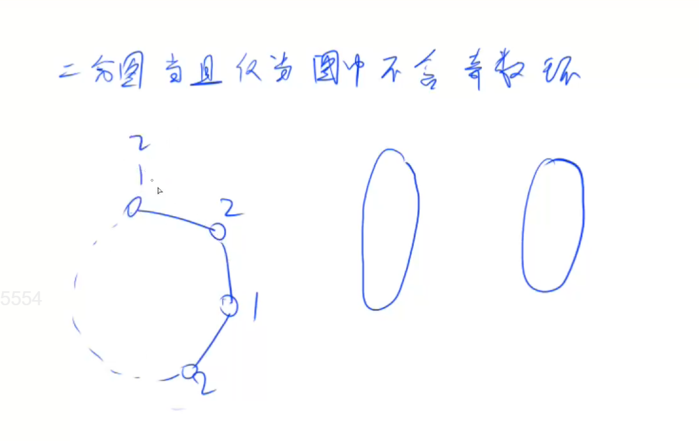

# 二分图

## 什么是二分图

把所有点划分到两边，使得所有的边都是在集合之间的。集合内部没有边。



## 染色法

染色法：判断一个图是不是二分图。方法：DFS染色。

图论一个很重要的性质：一个图是二分图，当且仅当这个图可以被2-染色。

一个图是二分图，当且仅当图中不含有奇数环。奇数环是指，环当中边的数量是奇数。证明：

如果图中存在奇数环的话，会推出矛盾：



## 染色法模板

n表示点数，m表示边数。时间复杂度 O(n+m)

```
int n;      // n表示点数
int h[N], e[M], ne[M], idx;     // 邻接表存储图
int color[N];       // 表示每个点的颜色，-1表示未染色，0表示白色，1表示黑色

// 参数：u表示当前节点，c表示当前点的颜色
bool dfs(int u, int c)
{
    color[u] = c;
    for (int i = h[u]; i != -1; i = ne[i])
    {
        int j = e[i];
        if (color[j] == -1)
        {
            if (!dfs(j, !c)) return false;
        }
        else if (color[j] == c) return false;
    }

    return true;
}

bool check()
{
    memset(color, -1, sizeof color);
    bool flag = true;
    for (int i = 1; i <= n; i ++ )
        if (color[i] == -1)
            if (!dfs(i, 0))
            {
                flag = false;
                break;
            }
    return flag;
}
```

## 题目

- 860
