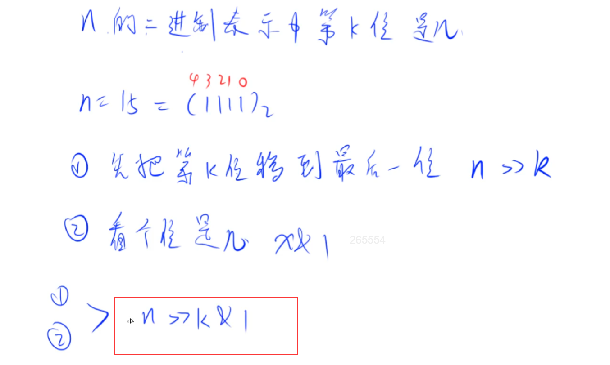
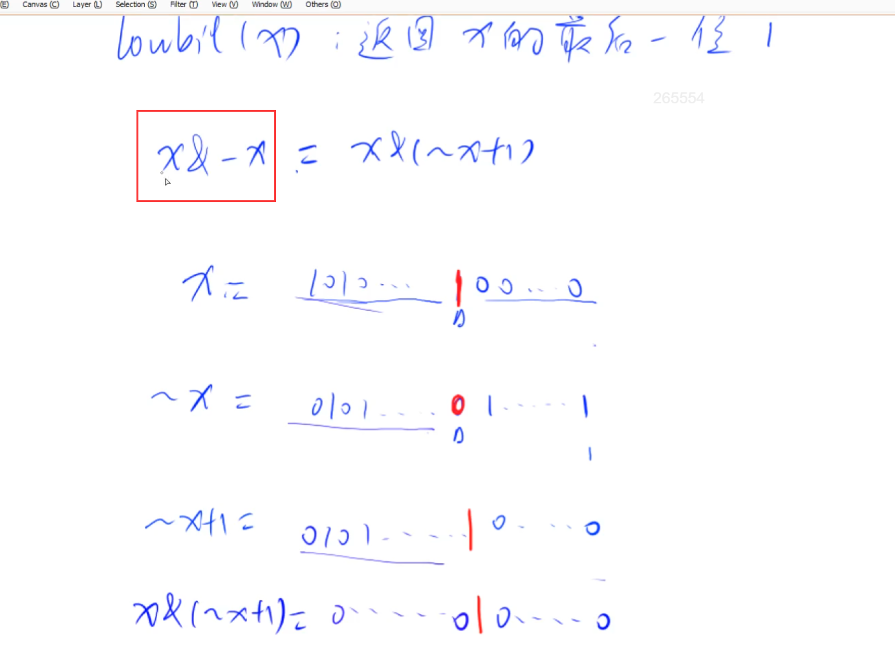

# 位运算

## 模板

```
求n的第k位数字: n >> k & 1
返回n的最后一位1：lowbit(n) = n & -n
```

## 1. 求n的第k位数字



## 2. 返回n的最后一位1

lowbit(x)： 返回x的最后一位1（返回的是一个二进制数，只有最高位时1，其他位都是0）

最简单的应用：统计x二进制表示中，1的个数。

做法：x每次减去最后一位1（最后一位1是一个二进制数），减去多少次，就说明有多少个1。也就是，使用lowbit操作，进行，每次lowbit操作截取一个数字最后一个1后面的所有位，每次减去lowbit得到的数字，直到数字减到0，就得到了最终1的个数。

lowbit原理：根据计算机负数表示的特点，如一个数字原码是10001000，他的负数表示形势是补码，就是反码+1，反码是01110111，加一则是01111000，二者按位与得到了1000，就是我们想要的lowbit操作。



## 题目

- 801 二进制中1的个数
