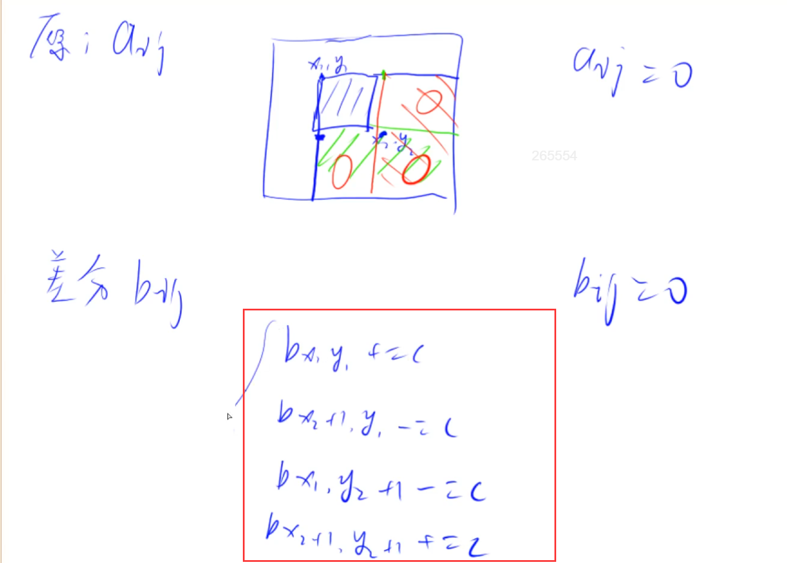

# 差分数组

## 背景

如果给你一个包含5000万个元素的数组，然后会有频繁区间修改操作，那什么是频繁的区间修改操作呢？比如让第1个数到第1000万个数每个数都加上1，而且这种操作时频繁的。

此时你应该怎么做？很容易想到的是，从第1个数开始遍历，一直遍历到第1000万个数，然后每个数都加上1，如果这种操作很频繁的话，那这种暴力的方法在一些实时的系统中可能就拉跨了。

## 介绍

差分和前缀和为逆运算。b数组称为a数组的差分。a就称为b的前缀和。换句话说，每一个a[i]都是b数组中从头开始的一段区间和: a[i] = b[1] + b[2 ]+ b[3] + ... + b[i]。我们只要有b数组，通过前缀和运算，就可以在O(n) 的时间内得到a数组。

**始终要记得，a数组是b数组的前缀和数组**，比如对b数组的b[i]的修改，会影响到a数组中从a[i]及往后的每一个数。

首先让差分b数组中的 b[l] + c ,a数组变成 a[l] + c ,a[l+1] + c ... a[n] + c;

然后我们打个补丁，b[r+1] - c, a数组变成 a[r+1] - c,a[r+2] - c ... a[n] - c;

为啥还要打个补丁？

我们画个图理解一下这个公式的由来:


b[l] + c，效果使得a数组中 a[l]及以后的数都加上了c(红色部分)，但我们只要求l到r区间加上c, 因此还需要执行 b[r+1] - c,让a数组中a[r+1]及往后的区间再减去c(绿色部分)，这样对于a[r] 以后区间的数相当于没有发生改变。

因此我们得出一维差分结论：给a数组中的[ l, r]区间中的每一个数都加上c,只需对差分数组b做 b[l] + = c, b[r+1] - = c。时间复杂度为O(1), 大大提高了效率。

差分用来解决数组区间 [l,r] 都 +C(常数) 的情况。

差分数组定义：

$$
b_1 = a_1\\
b_2 = a_2-a_1\\
b_3 = a_3-a_2\\
...\\
b_n = a_n-a_{n-1}

$$

对数组 [l,r] 区间的每个数都加上一个常数c，不需要傻傻地遍历数组的[l，r]范围，然后再分别给每个值加上c，我们此时更改差分数组 b 即可：

```go
func insert(l, r, c int) {
	b[l] += c
	b[r+1] -= c
}
```

如何得到差分数组b：

假定a数组初始的时候全部是0，那么差分数组b也全部都是0。但是数组a不是0啊，怎么办？我们可以看作是a数组进行了n次插入操作，第一次是a数组 [1,1]+a1, 第二次是 [2,2]+a2，一直到最后 [n,n] + an。所以差分数组就不用去想如何构造了，直接复用上方的 insert() 函数即可。

## 题目

- 797

## 总结

差分只有1个操作，如果想给数组 [l,r] 区间整段都加一个数的话，那就让 b[l] += c, b[r+1] -= c 即可。

## 模板

```
给区间[l, r]中的每个数加上c：B[l] += c, B[r + 1] -= c
```


# 二维差分

## 介绍



## 二维差分模板

```
给以(x1, y1)为左上角，(x2, y2)为右下角的子矩阵中的所有元素加上c：
b[x1, y1] += c, b[x2 + 1, y1] -= c, b[x1, y2 + 1] -= c, b[x2 + 1, y2 + 1] += c
```
