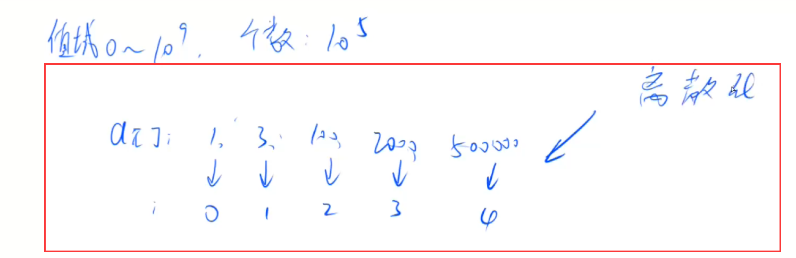
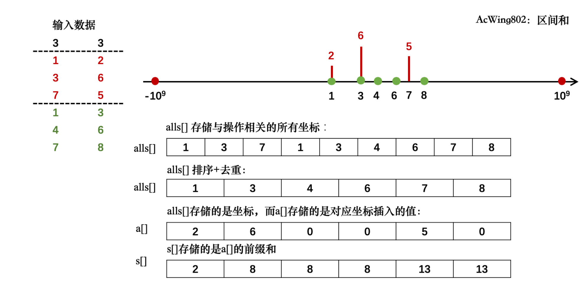
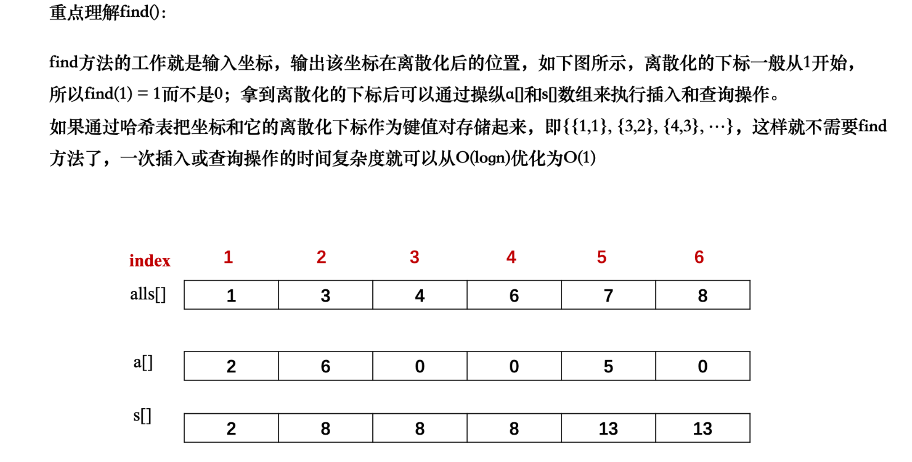

# 离散化

这里说的是整数的、保序的离散化。

离散化问题经典性质：整个值域非常大，但是很稀疏。也就是，下标范围很大，但是数很少，可以把下标映射成离散化下标。

举个例子，原本有数组 a[], 下标范围是10^9，但里面的数只有1，3，100，2000，500000。我们想要把原来的下标映射成从0开始的连续自然数。这个过程就叫做离散化。

但注意：

- a[]数组中可能有重复元素，需要去重。
- 如何算出x离散化后的值。因为a是有序的，所以可以通过二分来找。



模板题 802. 区间和

```操作go
vector<int> alls; // 存储所有待离散化的值， alls存储与操作相关的所有坐标
sort(alls.begin(), alls.end()); // 将所有值排序
alls.erase(unique(alls.begin(), alls.end()), alls.end());   // 去掉重复元素

// 二分求出x对应的离散化的值
int find(int x) // 找到第一个大于等于x的位置
{
    int l = 0, r = alls.size() - 1;
    while (l < r)
    {
        int mid = l + r >> 1;
        if (alls[mid] >= x) r = mid;
        else l = mid + 1;
    }
    // 映射到1, 2, ...n。加上1的话就是从1开始映射，不加1的话就是从0开始映射
    // 因为求前缀和，所以我们从1开始映射
    return r + 1; 
}
```

## 图解

这个图解太经典了，一看就懂。




