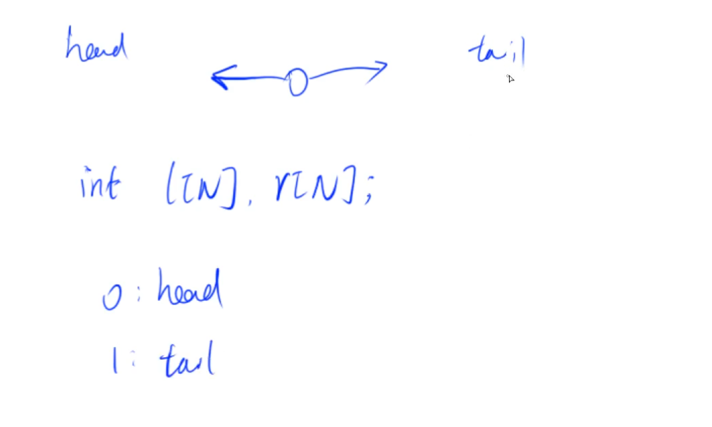
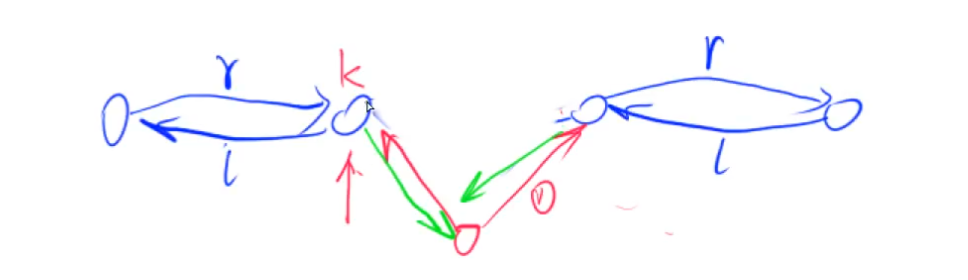
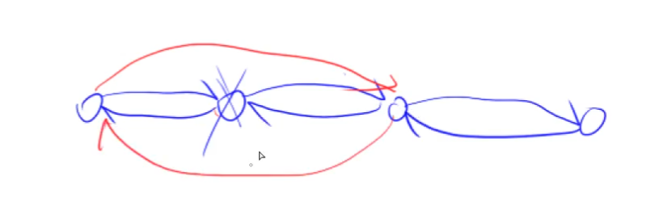
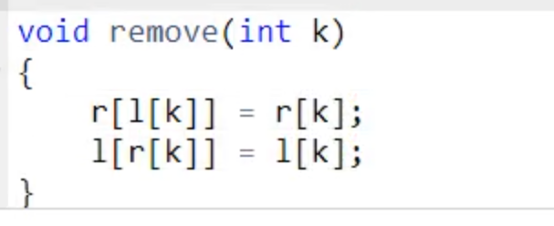

# 双链表

和单链表类似。

偷个懒，令下标为0的点是head，下标为1的点为tail。



## 在下标是k的点的右边，插入一个点



```c++
void add(int k,int x){
  e[idx] = x
  r[idx]=r[k]
  l[idx] = k
  l[r[k]] = idx
  r[k] = idx
  idx++
}
```

在下标是k的点的左边，插入x，怎么办呢？不用重新写，可以直接调用：

```
 add( l[k], x)
```

注意，是 l[k], 不是k-1。说k-1的，说明你对这种数据结构的认识还不够。

## 删除下标为k的点





## 题目

- 827 双链表
