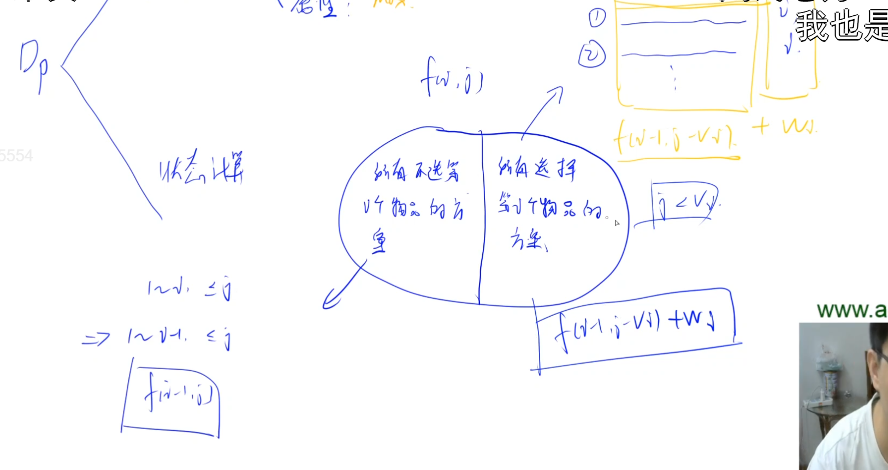

# 01背包问题

给N个物品和一个容量是V的背包，每个物品两个属性：

1. 体积：vi （i是下标）
2. 价值：wi (为什么用w来表示呢，因为习惯用w来表示权重，这里的价值其实是权重的意思)

每件物品最多用一次。用0次或者用1次。这也是01背包这个问题的由来。

问题是：我们要从这些物品里挑一些物品，使得总体积小于等于V。也就是背包能装的下的情况下，能挑出来的最大价值是多少。

## 特点

每件物品最多只能用一次。

## 题目

- 2

## 思路

- 状态表示。集合：从前i个物品中选，总体积<=j的所有选法。集合的属性：所有选法中，价值的最大值。
- 状态计算。看下面这张图的最底下，集合划分成2个子集：含i和不含i。注意左边这种情况是一定存在的，但是右边这种情况不一定存在。当 $j < v_i$ 时,（当j这个体积装不下第i个物品时），右边就是空集。
- 初始化。初始化要枚举所有的状态，也就是f[0-n][0-m]。f[0][0-m]表示的是考虑0件物品，总体积不超过0，不超过1…一直到不超过m，这样的情况下，最大价值是多少。由于1件物品都没选，所以f[0][0-m]都是0. 由于f数组定义成了全局变量，它默认就是0。所以f[0][0-m]=0这句初始化就可以不写。所以i从1开始枚举（因为f[0][0-m]都已经全部是0了），然后枚举所有的体积。

## 闫氏DP分析法

### 状态表示想不出来怎么办？

多做题。

比如01背包问题，就是一个选择问题。选择问题的状态表示都是很相似的，一般第一维都是只考虑前i个物品，后面几维基本都是限制，比如体积的限制、重量的限制、或者选几个的限制。

状态表示考虑2点：

1. 集合
2. 集合的属性

集合的描述也是有套路的：所有满足条件1、条件2…元素的集合。条件1、条件2就对应状态表示的每一维。

集合的属性，也就是存的值，一般要看问题问什么。

### 状态计算

对应集合的划分。怎么划分呢？一般是找最后一个不同点，也就是选最后一个物品的方法不同。选最后一个物品和不选最后一个物品其实是2个不同的方案。所以最后一个不同点就是选不选第i个物品。

取两个子集的最大值。

但右边这个集合不一定存在，有可能是空集。当j<v[i], 背包容量装不下第i个物品。所以需要特判一下。

