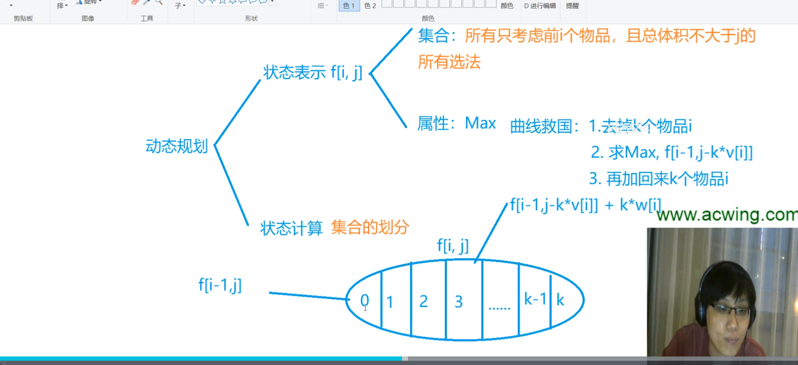
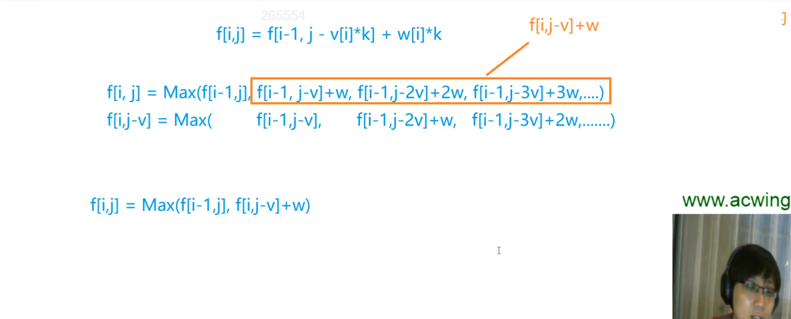

# 完全背包问题（UKP, unbounded knapsack problem）

每件物品有无限个。

## 解法

k不能无限大，因为第i个物品是有体积的，总体积不能超过背包的容量。



优化思路：

```
f[i , j ] = max( f[i-1,j] , f[i-1,j-v]+w ,  f[i-1,j-2*v]+2*w , f[i-1,j-3*v]+3*w , .....)
f[i , j-v]= max(            f[i-1,j-v]   ,  f[i-1,j-2*v] + w , f[i-1,j-3*v]+2*w , .....)
由上两式，可得出如下递推关系： 
                        f[i][j]=max(f[i,j-v]+w , f[i-1][j]) 
```

有了上面的关系，那么其实k循环可以不要了，核心代码优化成这样：

```
for i := 1; i <= n; i++ {
	for j := 0; j <= m; j++ {
		f[i][j] = f[i-1][j]
		if j >= v[i] {
			f[i][j] = max(f[i][j], f[i][j-v[i]]+w[i])
		}
	}
}
```



## 和01背包的区别

只有一句话的差别：

```
f[i][j] = max(f[i][j],f[i-1][j-v[i]]+w[i]);//01背包
f[i][j] = max(f[i][j],f[i][j-v[i]]+w[i]);//完全背包问题
```
