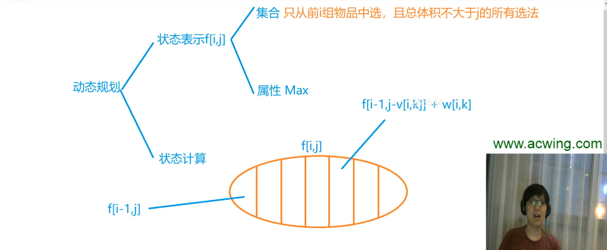

# 分组背包问题

物品有n组，每组物品里有若干种。比如水果这一组，有西瓜香蕉苹果。还有蔬菜这一组，比如油菜菜花土豆。然后每组里面最多只能选一个物品。

集合：只从前i组物品中选，且总体积不大于j的所有选法。

枚举第i组物品里选哪个。

f[i-1,j]表示第i组一个物品都不选。其他的是从第i组里选第k个物品。

大家记着，如果转移的时候用的是上一层的状态的话，就从大到小来枚举体积。如果用的是本层的状态的话，就要从小到大来枚举体积。

## 题目

- 9 分组背包问题
