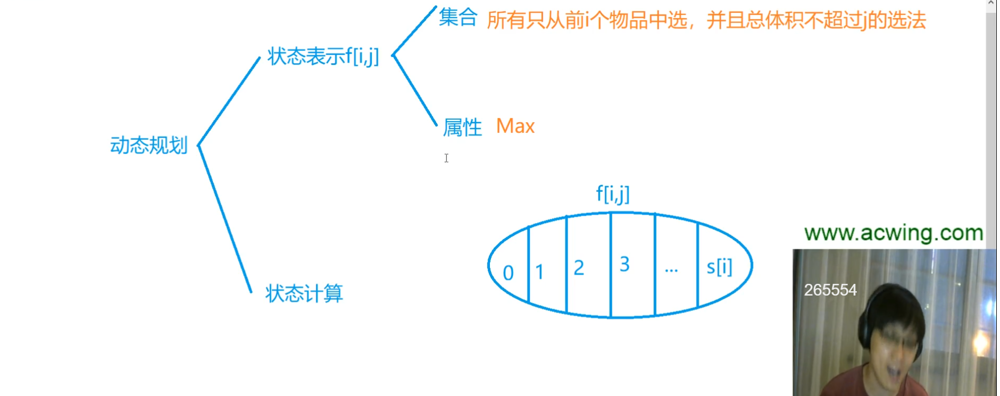
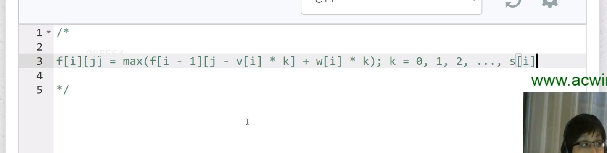
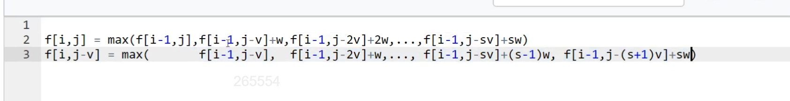

# 多重背包问题

每件物品的个数不一样，有限制。每件物品有Si个。

暴力解法：

## 优化

能不能用完全背包问题优化的思路呢？试一试：

比较蛋疼的是，最后多出来了一项。为什么完全背包问题没有这个最后一项呢？

因为完全背包问题是无限项，考虑极限，对于极限而言多一项少一项不影响结构，所以完全背包问题省略了最后一项。

因为多出来了最后一项，所以不能按照完全背包的方式来优化。

## 二进制优化方式

**引理**：从1，2，...，$2^m$ 中选一些数字相加，可以得出任意 [0, $2^{m+1}$) 内的值，每个数字只能用一次。可用数学归纳法证明。

就是拆分成多个新的物品，新的物品的体积和价值都定义好，最后用01背包问题解决。

**第i种物品可以使用$l_i$次，我们可以把它拆成 O(log n)个物品，每个物品只能用一次。**

举个例子，假设s=1023，也就是某个物品有1023个。除了从0到1023枚举，有没有更高效的方法枚举呢？可以，把若干个第i个物品打包，一块儿来考虑。比如打包成10组，分别是1，2，4，8，...，512。每组最多只能选一次。是不是能用这10组拼凑出从0到1023中的任何一个数。答案是肯定的。用第1组可以凑出来0-1。加上2以后，可以凑出来0-3。加上4可以凑出来0-7。以此类推，最终可以凑出来0-1023。其实就是用了10个新的物品来表示原来第i个物品。然后枚举这个10个物品选或者不选，就可以拼凑出来所有第i个物品的方案了。本来要枚举1023次，现在只需要枚举10次。所以就可以把其中的一维线性优化成logN。

假如第i个物品的个数是200，也就是s=200。怎么分组呢？1，2，4，8，16，32，64，73。64之后不能再加128了，如果加128，总数就是255，超过200了，一共才200个，如果能凑出来255，那就有点离谱了。一直到64，加起来是127。127+73=200，所以最后一个数是73。

讲一下为什么二进制优化可以哈。题目的意思是某物品最多有s件，我们需要从所有的物品中选择若干件，使这个背包的价值最大。题目并没有说某物品一定需要选多少件出来，也没有说一共要选多少件出来。只是选择若干件，至于选几件，无所谓，但要保证价值最大。按照优化的策略某物品有s件，我们给其打包分成了好几个大的物品。第一个大物品是包含原来该物品的1件，第二个大物品是包含原来该物品的2件，第三个大物品是包含原来该物品的4件，第四个大物品是包含原来该物品的8件,.....依次类推。此时我们就把所有的物品都重新进行了一个分类。原先每个物品最多s件，我们就把这个件数条件给消去了。取而代之的是，按照一定原先件数组合出来的新若干大物品。我们又已知按照我们划分成大物品进行搭配组合，一定能转化为原先的若干件小物品出来。并且选择某物品的最多件数，是不会超过原先该物品的s件。所以就转化为从下面这些若干件大物品中，选择能使背包容积最大大的情况下，价值最高。这个就是一个01问题。

## 题目

- 4 多重背包问题-1（暴力解法）
- 5 多重背包问题-2
