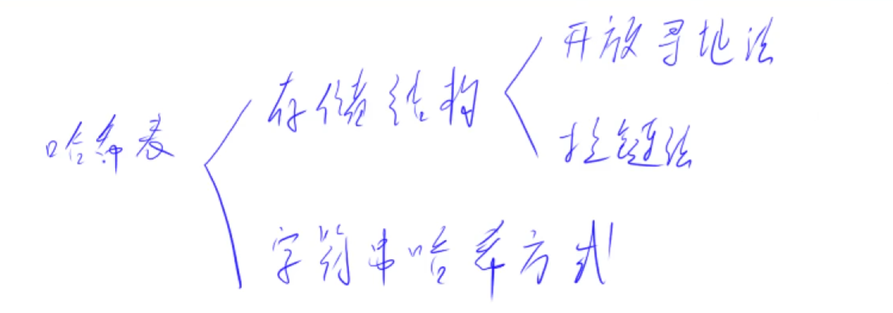
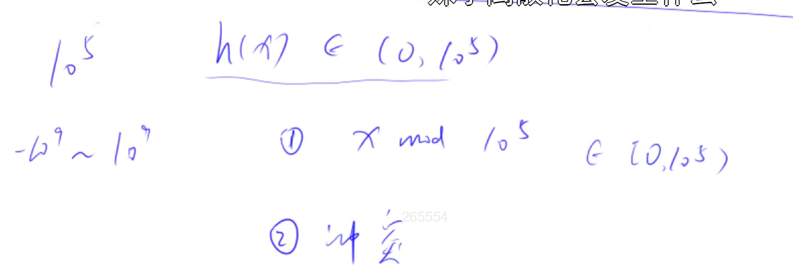
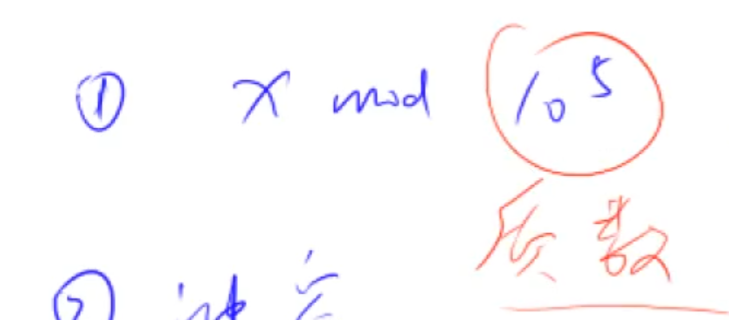
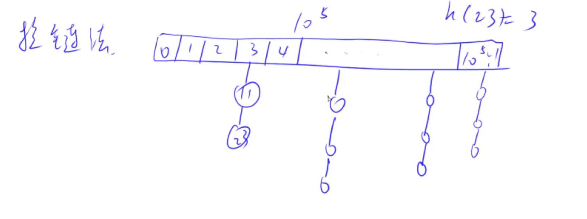
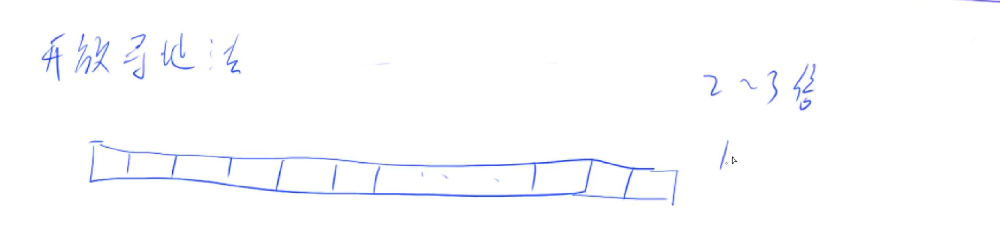
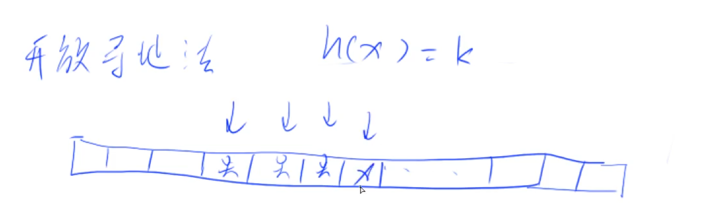
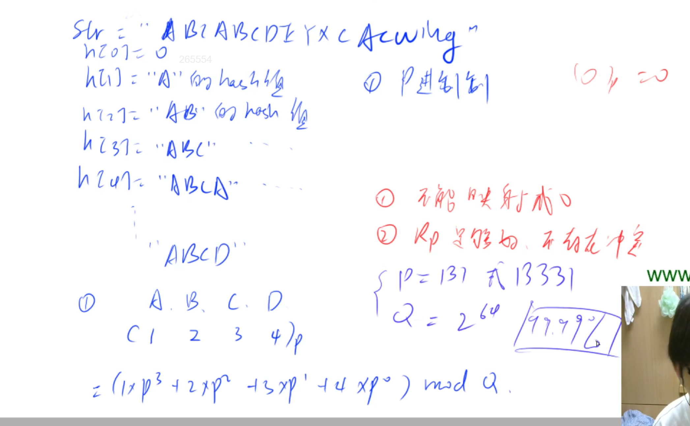
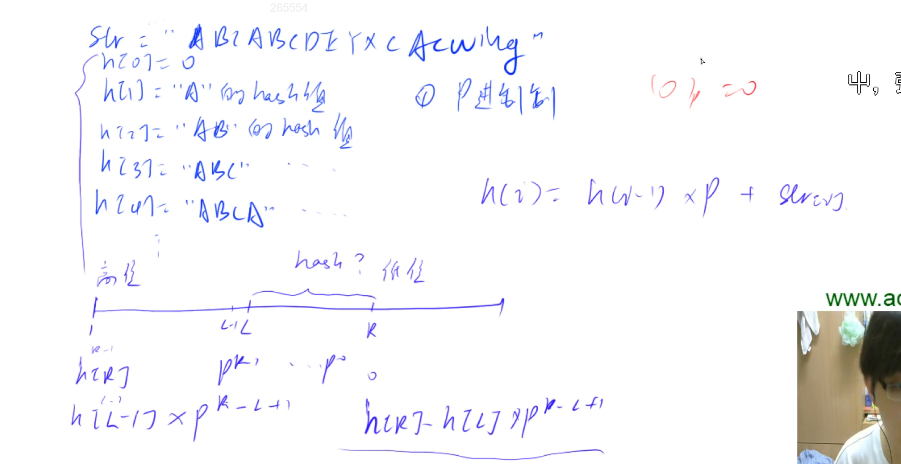

# 哈希表



## 哈希表最主要的作用

把一个比较庞大的空间或者值域，映射到一个比较小的空间，比如从0~N，N一般比较小，可能是10^5 或者 10^6。

常见情景：把0到10^9这些数，映射到0~10^5。

## 哈希函数怎么写

x取模。注意，模的数一般要取成一个质数。而且这个质数要尽可能的离2的整数幂远。数学上可以证明，这么取的话，冲突的概率是最小的。





## 2种解决冲突的办法

### 1. 拉链法

每个槽上拉一条链，用来存储这个槽上当前已经有的所有数。

算法题中，一般不需要从哈希表中删除元素，一般只有添加或者查找。插入一般都是头插。如果要删除，一般也不会真的删除，而是开个bool变量，标记一下。



### 2. 开放寻址法

数组长度一般要开到题目数据范围的2到3倍。





跟上厕所一样，先去第k个坑位，如果有人，就去下一个坑位，直到找到一个无人的。

重点在于find函数，和拉链法不一样。如果x在哈希表中存在，find函数返回x所在的位置。如果x在哈希表中不存在，find函数返回的是x应该存储的位置。

## 模板

```
(1) 拉链法
    int h[N], e[N], ne[N], idx;

    // 向哈希表中插入一个数
    void insert(int x)
    {
        // 如果是负数, 那他取模也是负的, 所以 加N 再 %N 就一定是一个正数
        int k = (x % N + N) % N;
        // 标准的头插法，只不过头节点是h[k]
        e[idx] = x;
        ne[idx] = h[k];
        h[k] = idx ++ ;
    }

    // 在哈希表中查询某个数是否存在
    bool find(int x)
    {
        // 用上面同样的 Hash函数，将x映射到 从 0-N 之间的数
        int k = (x % N + N) % N;
        for (int i = h[k]; i != -1; i = ne[i])
            if (e[i] == x)
                return true;

        return false;
    }

(2) 开放寻址法
    int h[N];
    const null int = 0x3f3f3f3f

    // 如果x在哈希表中，返回x的下标；如果x不在哈希表中，返回x应该插入的位置
    int find(int x)
    {
        int t = (x % N + N) % N;
        while (h[t] != null && h[t] != x)
        {
            t ++ ;
            if (t == N) t = 0;
        }
        return t;
    }
```

## 题目

- 840

## 字符串哈希





### 字符串哈希模板

```
核心思想：将字符串看成P进制数，P的经验值是131或13331，取这两个值的冲突概率低
小技巧：取模的数用2^64，这样直接用unsigned long long存储，溢出的结果就是取模的结果

typedef unsigned long long ULL;
ULL h[N], p[N]; // h[k]存储字符串前k个字母的哈希值, p[k]存储 P^k mod 2^64

// 初始化
p[0] = 1;
for (int i = 1; i <= n; i ++ )
{
    h[i] = h[i - 1] * P + str[i];
    p[i] = p[i - 1] * P;
}

// 计算子串 str[l ~ r] 的哈希值
ULL get(int l, int r)
{
    return h[r] - h[l - 1] * p[r - l + 1];
}
```

### 原理

全称字符串前缀哈希法，把字符串变成一个p进制数字（哈希值），实现不同的字符串映射到不同的数字。

对形如 $X_1X_2X_3...X_{n-1}X_n$的字符串,采用字符的ascii 码乘上 P 的次方来计算哈希值。

映射公式 $(X_1 \times P^{n-1}+X_2 \times P^{n-2}+...+X_{n-1} \times P^{1}+X_n \times P^0) mod Q$

注意点：

- 任意字符不可以映射成0，否则会出现不同的字符串都映射成0的情况，比如A,AA,AAA皆为0
- 冲突问题：通过巧妙设置P (131 或 13331) , Q ($2^{64}$)
  的值，一般可以理解为不产生冲突。

问题是比较不同区间的子串是否相同，就转化为对应的哈希值是否相同。

求一个字符串的哈希值就相当于求前缀和，求一个字符串的子串哈希值就相当于求部分和。

- 前缀和公式：$h[i]=h[i-1] \times P + str[i]$, h为前缀和数组, str为字符串数组
- 区间和公式：$h[l,r] = h[r] - h[l-1] \times P^{r-l+1}$

区间和公式的理解: ABCDE 与 ABC 的前三个字符值是一样，只差两位，乘上 $P^2$ 把 ABC 变为 ABC00，再用 ABCDE - ABC00 得到 DE 的哈希值。

### 字符串哈希题目

- 841
