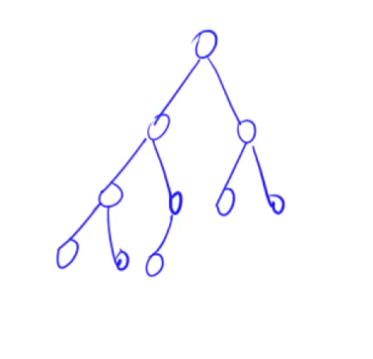
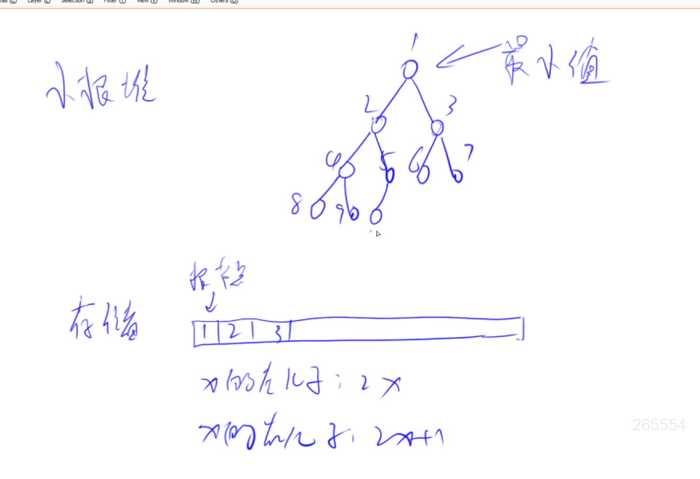
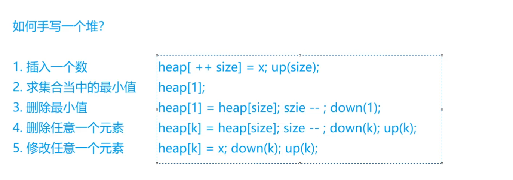

# 堆（手写一个堆）

堆是完全二叉树。除了最后一层节点，上面所有节点都是非空的。最后一层节点是从左到右依次排布的。

以小根堆为例，每个点都是小于等于左右儿子的。所以根节点是整棵树的最小值。



## 堆的存储

用一维数组存。完全二叉树都是这么存。



## 如何手写一个堆



down是往下调，up是往上调。可以用up down维护这5个操作。

* 插入一个数，就是在末尾插入一个数。up一遍。
* 求最小值，就是第一个数。
* 删除最小值，就是拿最后一个数覆盖第一个数，然后把最后一个数干掉，down一遍。
* 删除任意一个数，就是拿最后一个数覆盖掉这个数，down一遍，up一遍。虽然这里up down都写了，但只有一个会执行。之所以都写一遍，是为了避免判断数是变大了还是变小了。
* 修改任意一个数，就是把某个数修改完以后，down一遍，up一遍。

## O(N)建堆

一般建堆，大家会用插入元素操作，所有元素插入一遍，时间复杂度O(n*logn)。

其实还有一种O(n)的建堆方法，就是从n/2开始down。

```
// O(N) 建堆
for i := n / 2; i > 0; i-- {
    down(i)
}
```

i为什么从n/2开始down？

首先要明确要进行down操作时必须满足左儿子和右儿子已经是个堆。

开始创建堆的时候，元素是随机插入的，所以不能从根节点开始down，而是要找到满足下面三个性质的结点：

1.左右儿子满足堆的性质。

2.下标最大（因为要往上遍历）

3.不是叶结点（叶节点一定满足堆的性质）

那这个点为什么时n/2？看图。


## 模板

```
const N int = 1e5 + 10

// h[N]存储堆中的值, 下标从1开始，h[1]是堆顶，x的左儿子是2x, 右儿子是2x + 1
var h [N]int
var size int // 堆中元素个数

// O(N) 建堆
for i := n / 2; i > 0; i-- {
    down(i)
}

// 小根堆
// u is index
func down(u int) {
	// t 表示 三个点里的最小值。三个点分别是u, u的左儿子, u的右儿子
	t := u
	// u的左儿子存在且小于u
	if 2*u <= size && h[2*u] < h[t] {
		t = 2 * u
	}
	// u的右儿子存在且小于u
	if 2*u+1 <= size && h[2*u+1] < h[t] {
		t = 2*u + 1
	}
	if t != u { // 说明根节点不是最小的
		// swap
		h[t], h[u] = h[u], h[t]
		// 递归处理
		down(t)
	}
}

// up比down简单
func up(u int) {
	// u/2表示根节点，u/2 > 0 根节点存在
	for u/2 > 0 && h[u/2] > h[u] {
		// swap
		h[u/2], h[u] = h[u], h[u/2]
		u = u / 2
	}
}
```

## 题目

- 838
