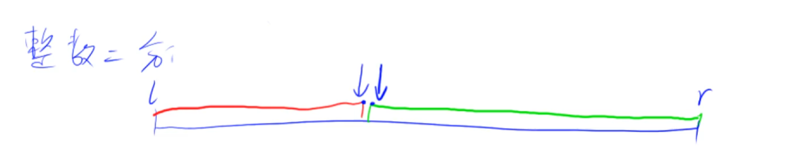
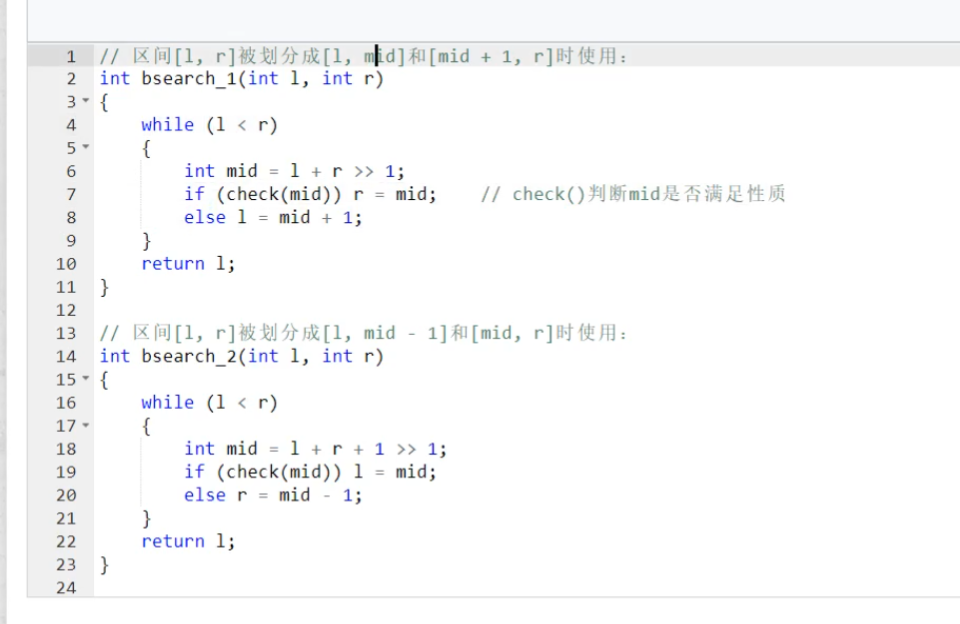

# 整数二分查找

很蛋疼，有很多边界条件。一不小心就会写出死循环。

俩模板。

二分和单调性没有必然联系。有单调性一定可以二分，但二分的题并不一定需要单调性。所以二分的本质不是单调性，而是边界。

我们在这个区间上定义了某种性质，使得数组能分成左右两半，一半满足，一半不满足，那么二分就可以寻找这个性质的边界（比如性质是>=x，那么就可以找等于x的起始位置）。二分出边界点，也就是红色边界点或者绿色边界点。找红色边界点、绿色边界点分别对应2种模板。

## 2种模板

怎么判断用哪个模板呢？先随便写一个check函数，判断check函数的结果是true还是false，最根本的就是看l=mid还是r=mid，如果l=mid，就要补上+1，r=mid的话就不需要补上+1。

## 总结

二分，每次选择区间的时候，都要选择答案所在的区间进行更新。

二分的时候一定是有解的。如果是无解的，是跟题目有关的，跟二分的模板是没有关系的。二分的模板是一定保证有解的。为什么出现无解呢？是跟题目有关的，比如找一个数在数组中的起始位置和终止位置，二分模板是有解的，只是解不是题目要的那个解，所以变成了无解。
