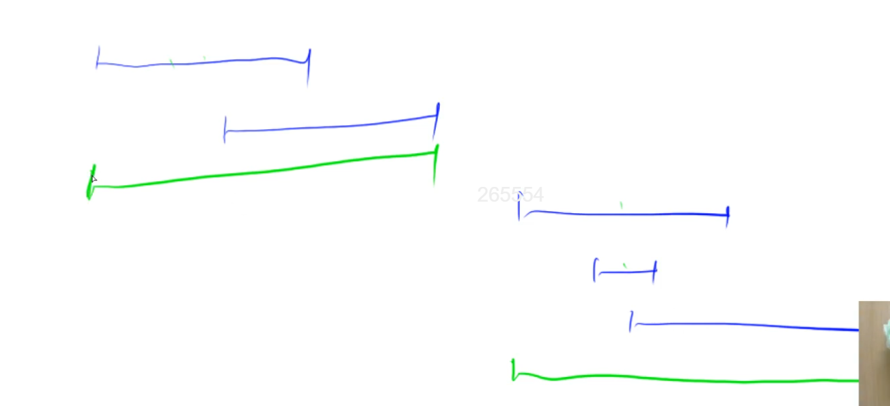
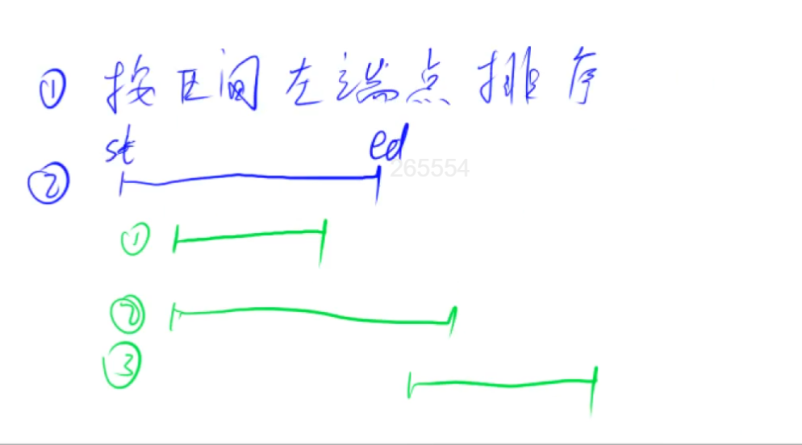
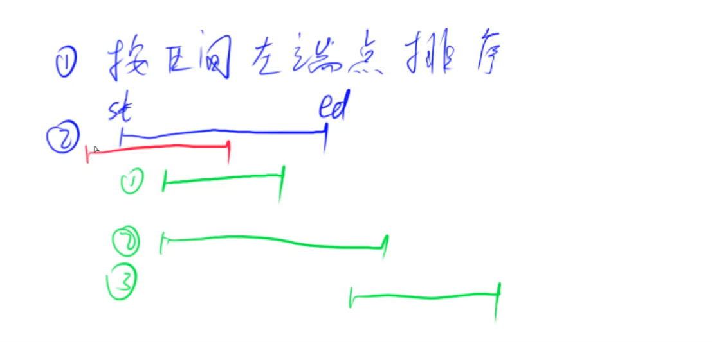

# 区间合并

## 应用场景

给很多区间，如果区间有交集，就合并。

如下图，5个蓝色区间，合并结果是2个绿色区间。注意：如果两个区间仅端点相交，也是可以合并的。



## 思路

1. 按区间左端点排序。
2. 区间之间的关系只有3



不会出现下图中红色的情况，因为区间是按左端点排序的。



## 模板

```c++
// 将所有存在交集的区间合并
void merge(vector<PII> &segs)
{
    vector<PII> res;

    sort(segs.begin(), segs.end());
  
    // 最开始还没有任何区间，为了能让第一个区间进来，所以设一个边界值，负无穷
    // 因为题目输入范围是-10^9 ~ 10^9，所以负无穷可以设为-2e9
    // st就是start, ed就是end，都设为负无穷
    int st = -2e9, ed = -2e9;
    for (auto seg : segs)
        // 当前区间的右端点，严格在枚举的区间的左边的话（没有任何交集），说明找到了一个新区间
        if (ed < seg.first)
        {
            // 要if判断一下，不能是我们最初的初始区间
            if (st != -2e9) res.push_back({st, ed});
            st = seg.first, ed = seg.second;
        }
        // 否则的话，当前区间和所维护的区间是有交集的，更新右端点的值
        else ed = max(ed, seg.second);
  
    // 也要把最后一个区间加到答案里面去
    // 这个if判断是为了防止segs是空的
    if (st != -2e9) res.push_back({st, ed});

    segs = res;
}
```

## 题目

- 803 合并区间
