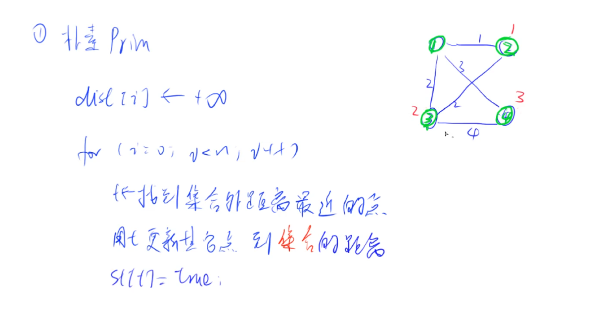
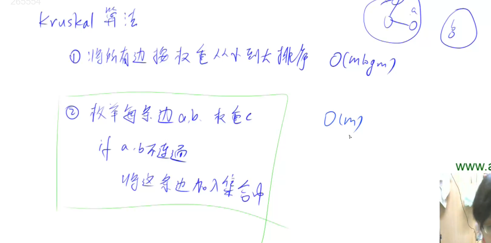

# 最小生成树

对应的图都是无向图。图论题目的难一般是难在建图上。

稠密图用朴素版prim, 稀疏图用krustal。堆优化版prim不怎么用。


## 1. 朴素版prim

和dijkstra很像。

到集合的距离，就是看一下其他点，有没有一条边，能连到集合内部。

某一个点到集合的距离，就定义成，这个点到集合内部的所有边当中，长度最小的边。

生成树其实就是每一次选中的点（t这个点），它的距离对应的那条边，就是生成树里的一条边。

迭代n次是因为要加入n个点进来。

最小生成树里，边正的负的都可以。

dist[t]的含义和dijkstra不一样。dijkstra的dist[t]表示的是t号点到1号点的距离，prim里dist[t]表示的是这个点到集合的距离。



### 1.1 prim模板

时间复杂度$O(n^2+m)$

```
int n;      // n表示点数
int g[N][N];        // 邻接矩阵，存储所有边
int dist[N];        // 存储其他点到当前最小生成树的距离
bool st[N];     // 存储每个点是否已经在生成树中


// 如果图不连通，则返回INF(值是0x3f3f3f3f), 否则返回最小生成树的树边权重之和
int prim()
{
    memset(dist, 0x3f, sizeof dist);

    int res = 0;
    for (int i = 0; i < n; i ++ )
    {
        int t = -1;
        for (int j = 1; j <= n; j ++ )
            if (!st[j] && (t == -1 || dist[t] > dist[j]))
                t = j;

        if (i && dist[t] == INF) return INF;

        if (i) res += dist[t];
        st[t] = true;

        for (int j = 1; j <= n; j ++ ) dist[j] = min(dist[j], g[t][j]);
    }

    return res;
}
```

## 2. kruskal

基本思路非常简单。



如何判断a, b 是否连通？并查集，请看：837题，连通块中点的数量。

不需要用邻接表或者邻接矩阵存图。只要把每条边存下来就可以了。可以开一个结构体来存。

## 题目

- prim: 858
- kruskal: 859
