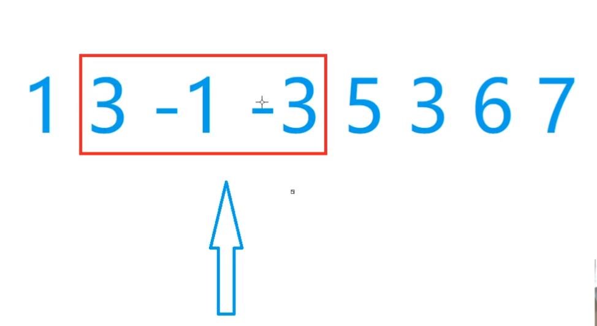
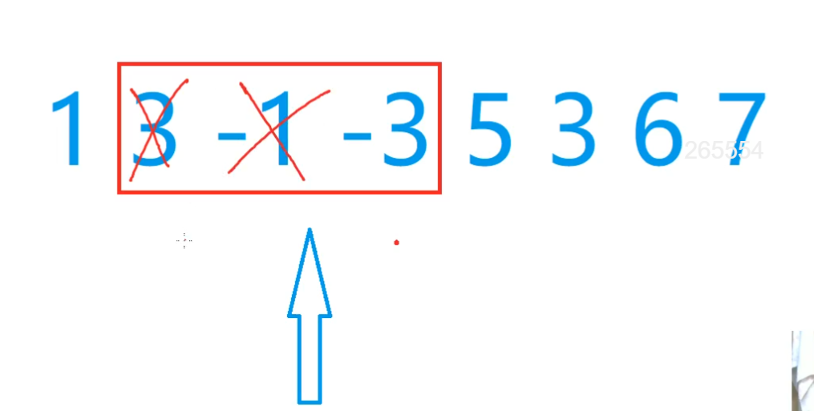
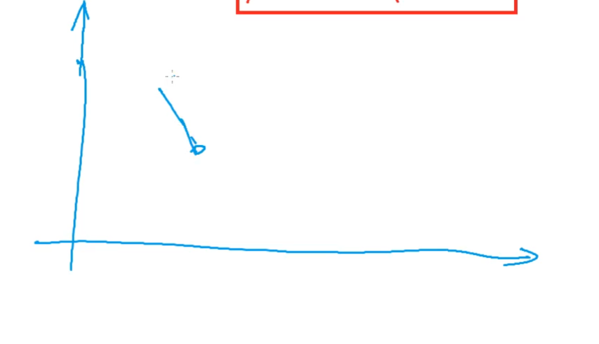
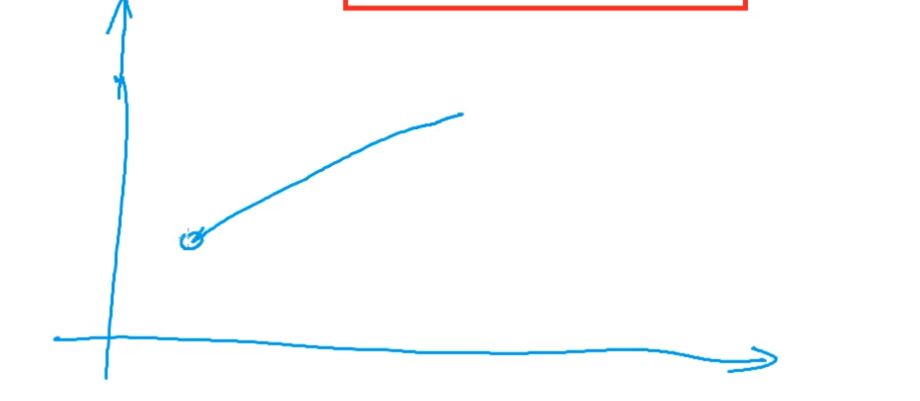

# 单调队列

## 场景

找出滑动窗口中的最大值/最小值。

## 优化思路

和单调栈一样，先想暴力的方法，从中挖掘一些性质，把没有用的元素删掉，得到单调性。有单调性求极值，就可以直接拿第一个点或者最后一个点。就可以把O(n)复杂度变成O(1)。

用队列维护窗口。假设窗口中有k个元素。

暴力做法，就是遍历队列中的所有元素，那时间复杂度就是O(k)了。

## 例子

求滑动窗口最小值。

如果是求滑动窗口的最小值，因为-3是小于3的，而且3是在-3的左边，所以3会被先从队列中移除。换句话说，只要-3在的一天，这个3就一定是比-3要大的，它就永远不会被当成最小值输出。也就是-3在一天，3就永无出头之日。而且-3活的还比3久。所以3就没用了，可以删掉。-1也是同理。

总结一下，只要队列里存在这种情况：

前面数比后面数大，就可以断定前面这个数没有用。只要有这样的逆序对，就可以把大的数删掉。逆序对全部删掉以后，整个队列就是严格单调上升的序列。

## 怎么知道队头什么时候出队呢？

i， k 是知道的。i是当前枚举的右端点，k是窗口的长度。队列里存的不是值，是下标。因此，可以直接判断一下，队头的下标是否超出了 [i-k+1,i] 这个范围，超出的话就把队头删掉。
