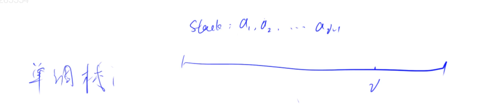
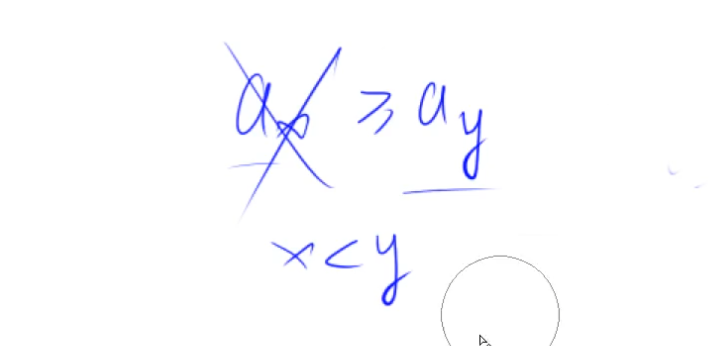

# 单调栈

## 场景

找出每个数左边离它最近的比它大/小的数。

## 优化思路

先想暴力的方法，从中挖掘一些性质，把没有用的元素删掉，得到单调性。

### 暴力

用栈存储i左边的所有元素。每次找的时候，从栈顶往前找，找到第一个比i小的数，就停下来。



### 优化

找一找栈内有没有什么性质，栈内的哪些数一定不会是结果。发现当下面条件出现时，$a_x$就可以删掉了。因为如果$a_x$可以输出的话，$a_y$必然也可以输出。

只要有这样逆序的关系，前面的数就可以被删掉。所以，最后剩下的栈序列一定是一个单调序列。



当i来了之后，想找到i左边离i最近的比i小的数在什么地方。就可以从栈顶开始找。

如果 $stk[tt] >= a_i$, 待会儿i要插进来，i插进来以后，i是比栈顶要小的，而且i是在更右边，所以栈顶就永远不可能是答案了，可以删掉。只要栈顶是大于等于i，就可以删掉。可以一直删，直到栈顶 $stk[tt] < a_i$。此时，栈顶就是要找的，离i最近的且比它小的点。然后再把 $a_i$ 插入到栈中去。

## 模板

```
常见模型：找出每个数左边离它最近的比它大/小的数
int tt = 0;
for (int i = 1; i <= n; i ++ )
{
    while (tt && check(stk[tt], i)) tt -- ;
    stk[ ++ tt] = i;
}
```

## 总结

- 求窗口最小值时，删除的是逆序对（最后队列是单调递增）。求窗口最大值时，正相反，删除的是顺序对（最后队列是单调递减）。
