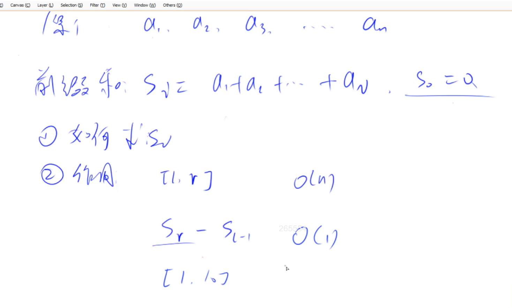
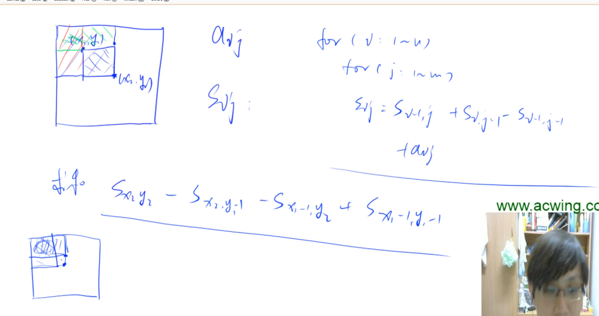

# 前缀和

前缀和不算一个模板，其实是个公式。

## 公式

$$
s[i] = s[i-1] + a_i
$$

## 作用

能快速求出，原数组中一段的和。

例如，求[l,r]的和，如果没有前缀和，时间复杂度O(n)。

前缀和预处理是O(n), 每次查询是O(1)。

## 题目

795

## 注意

- 为了定义 s[0] = 0，避免处理麻烦的边界，数组从下标为1的地方开始存，而不是从0开始。

# 子矩阵的和

