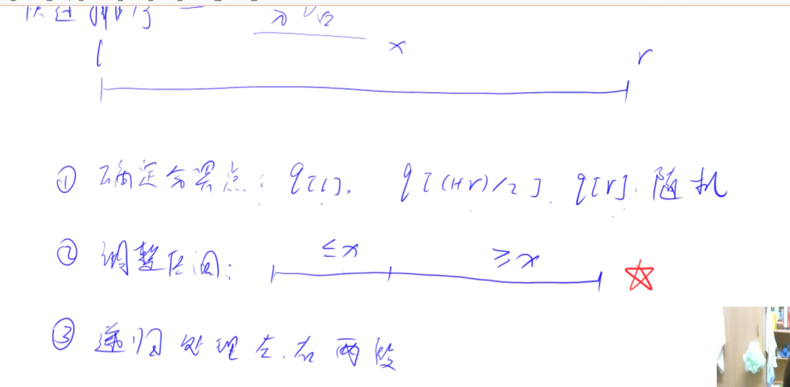
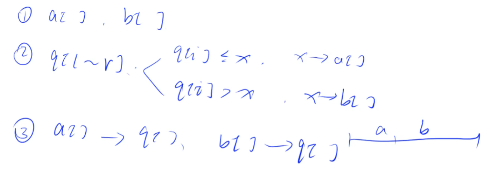
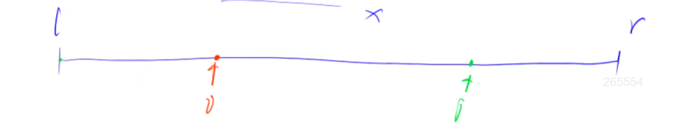

# 快速排序

快排是分治的思想。

## 最重要的：如何优雅的调整区间？

1. 暴力做法，耗费点空间。如果忘了其他优雅的方法，可以用这个暴力的方法临时替代一下。

2. 双指针

左右两个指针，当i指向的数小于pivot时，不用动，i移动到下一个。如果i指向的数大于等于pivot，说明它该放到右边，这时保持i不动，移动j。如果j指向的数大于pivot，不用动，j往前移动一个。如果j指向的数小于等于pivot，说明它该放到左边。这时，i指向的数需要放右边，j指向的数需要放左边，直接swap。swap之后，i，j分别往中间移动一位。直至I,j相遇结束。

边界问题建议大家背一个模板。因为比赛的时候，没有时间把各种边界问题重新推一遍。
