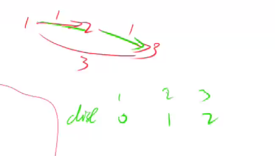

# Bellman-Ford算法

求有负权的最短路。

这个算法，边怎么存都行，甚至用下面这种结构体都可以：

```
// Edge 把每个边保存下来即可。这个算法，边怎么存都行
type Edge struct {
	a, b, w int
}
```

## 距离更新方式

和dijkstra类似：


## 算法


## 负权回路情况

如果存在负权回路，最短路径就不一定存在了。

举个例子， 2，3，4是负权回路，也就是这条回路上的权重之和是负数。转一圈距离减1，那可以转无穷多圈，总的距离就会变成负无穷。


有负环，最短路径也还有可能存在。什么情况存在呢？比如求1号点到n号点的最短路。2号点存在负环，但2号点到不了n号点。


## 时间复杂度

O(n*m)

- n表示点数
- m表示边数

# 和SPFA算法区别

SPFA各方面都优于Bellman-Ford，但问题是，有些题，只能用Bellman-Ford算法来做，比如存在负环（SPFA算法不允许存在负环）。

## 题目

- 853 有边数限制的最短路。如果限制了经过的边的个数，那么就不能在负环里无限转了，所以有负环也就无所谓了。

## 为什么需要backup数组

为了避免如下的串联情况，在边数限制为一条的情况下，节点3的距离应该是3，但是由于串联情况，利用本轮更新的节点2更新了节点3的距离，所以现在节点3的距离是2。



正确做法是用上轮节点2更新的距离--无穷大，来更新节点3，再取最小值，所以节点3离起点的距离是3。


## 为什么是dist[n]>0x3f3f3f3f/2， 而不是dist[n]>0x3f3f3f3f

5号节点距离起点的距离是无穷大，利用5号节点更新n号节点距离起点的距离，将得到$10^9−2$, 虽然小于$10^9$，但并不存在最短路，(在边数限制在k条的条件下)。


